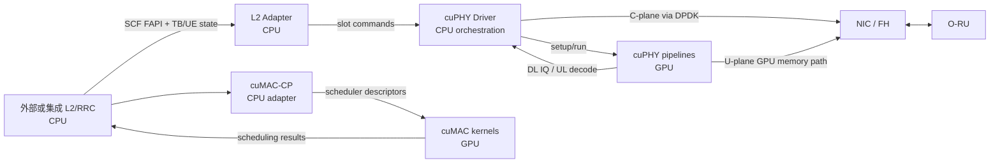

# NVIDIA Aerial NR gNB 架构基线

**源码基线：** `29f5870fd84b0176df48b40667c1b8f1740e6d09`
**文档基线：** Aerial CUDA-Accelerated RAN 26.1
**研究范围：** NR gNB 的 L1、MAC 调度、L2/L1 适配与 O-RAN 7.2x 前传；UE、核心网与非 RAN AI 应用不在本页范围内。

## 架构结论

Aerial 不是把一个传统 CPU gNB 整体“编译到 GPU”。源码和官方组件文档呈现的是分层异构结构：CPU 侧的 L2 Adapter、cuPHY Controller/Driver、cuMAC-CP 和前传控制面负责配置、时序、消息翻译与任务编排；GPU 侧的 cuPHY channel pipelines、cuMAC 算法核以及前传用户面数据处理负责并行计算。外部 L2/RRC 是否由 OAI 或第三方栈提供，是集成选择，不应被误记为 cuPHY 自身能力。

## 模块输入、输出与执行边界

| 模块 | 输入 | 输出 | 执行位置 | 所有权与依赖 | 实时边界与固定源码证据 |
|---|---|---|---|---|---|
| L2 Adapter | SCF FAPI 配置、DL/UL slot 请求、TB 数据 | cuPHY slot command；slot/CRC/UCI/测量 indications | CPU | Aerial；NVIPC、FAPI handler | 维护 slot timing，晚到消息可丢弃。官方组件文档 26.1 “L2 Adapter”（E1）。 |
| cuPHY Controller / Driver | L2 slot command、cell/OAM 配置、FH 状态 | 每 slot 的 DL/UL channel pipeline 启动；结果回送 L2；FH C/U-plane 工作 | CPU 编排，启动 GPU 工作 | Aerial；CUDA runtime、cuPHY、FH library | [`cuphydriver.cpp`](https://github.com/NVIDIA/aerial-cuda-accelerated-ran/blob/29f5870fd84b0176df48b40667c1b8f1740e6d09/cuPHY-CP/cuphycontroller/src/cuphydriver.cpp) 中 `pc_standalone_create_cells`/`l1_cell_create`；[`phypdsch_aggr.cpp`](https://github.com/NVIDIA/aerial-cuda-accelerated-ran/blob/29f5870fd84b0176df48b40667c1b8f1740e6d09/cuPHY-CP/cuphydriver/src/downlink/phypdsch_aggr.cpp) 中 `PhyPdschAggr::createPhyObj`、`cuphyCreatePdschTx`；[`phypusch_aggr.cpp`](https://github.com/NVIDIA/aerial-cuda-accelerated-ran/blob/29f5870fd84b0176df48b40667c1b8f1740e6d09/cuPHY-CP/cuphydriver/src/uplink/phypusch_aggr.cpp) 中 `PhyPuschAggr`（E2）。 |
| cuPHY channel pipelines | FAPI 派生的静态/动态参数、DL TB 或 UL IQ | DL resource-grid IQ；UL TB、CRC/UCI、信道测量 | GPU | Aerial；CUDA kernels、CUDA streams/graphs | 官方文档将 pipeline 定义为按 channel 组织、按 slot 由 driver 动态管理；[`crc.cu`](https://github.com/NVIDIA/aerial-cuda-accelerated-ran/blob/29f5870fd84b0176df48b40667c1b8f1740e6d09/cuPHY/src/cuphy/crc/crc.cu) 直接包含 `crcUplinkPuschCodeBlocksKernel`、`crcDownlinkPdschTransportBlockKernel` 等 `__global__` kernels（E1+E2）。 |
| FH Driver | FAPI 触发的 slot 工作、eAxC/VLAN/RU 配置、DL IQ 或 UL packets | C-plane packet；DL U-plane packet；写入 GPU memory 的 UL U-plane packet | C-plane 主要在 CPU；U-plane 存在 GPU/NIC 直接路径 | Aerial；DPDK、DOCA GPU NetIO、NIC | 26.1 文档明确区分 CPU 发起的 C-plane/DPDK 与 GPU memory U-plane/DOCA；[`fronthaul.cpp`](https://github.com/NVIDIA/aerial-cuda-accelerated-ran/blob/29f5870fd84b0176df48b40667c1b8f1740e6d09/cuPHY-CP/aerial-fh-driver/lib/fronthaul.cpp) 中 `Fronthaul::eal_init`、`Fronthaul::doca_gpu_setup`（E1+E2）。 |
| cuMAC-CP | 第三方 L2 的 per-slot scheduler 输入、cell/UE/SRS 数据 | GPU scheduler task、调度结果与回调 | CPU，管理 CUDA streams 与 buffers | Aerial；NV transport wrapper、CUDA runtime | [`cumac_cp_handler.cpp`](https://github.com/NVIDIA/aerial-cuda-accelerated-ran/blob/29f5870fd84b0176df48b40667c1b8f1740e6d09/cuMAC-CP/src/cumac_cp_handler.cpp) 中 `cumac_cp_handler::initiate_cumac_task`、`cudaStreamCreate`（E2）。 |
| cuMAC 4T4R / 64T64R | cell-group 参数、UE metric、SRS channel estimates、traffic/HARQ state | UE selection、PRB/layer/MCS/beamforming 或 MU-MIMO grouping 结果 | GPU | Aerial；CUDA kernels，部分算法另有 CPU baseline 文件 | [`multiCellScheduler.cu`](https://github.com/NVIDIA/aerial-cuda-accelerated-ran/blob/29f5870fd84b0176df48b40667c1b8f1740e6d09/cuMAC/src/4T4R/multiCellScheduler.cu) 的 `multiCellSchedulerKernel_*`；[`multiCellMuUeGrp.cu`](https://github.com/NVIDIA/aerial-cuda-accelerated-ran/blob/29f5870fd84b0176df48b40667c1b8f1740e6d09/cuMAC/src/64T64R/multiCellMuUeGrp.cu) 的动态/半静态 grouping kernels（E2）。 |

## CPU/GPU 数据流

## 本阶段不能推出的结论

- 清单与源码符号可以证明 CUDA kernels、CPU 编排类和 GPU/NIC 路径存在，但不能在无 Aerial 硬件时证明 slot deadline、吞吐或功耗。
- 文档中的“commercial-grade”“20 cells”等属于厂商声明，必须在后续 claims 中标为 `vendor_claim`，不能升级为 `measured_fact`。
- `cuMAC` 是 GPU scheduler 能力，不等价于完整 RLC/RRC/CU/DU 协议栈。
