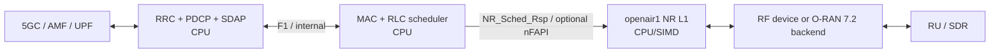

# Duranta/OpenAirInterface NR gNB 架构基线

**源码基线：** `31ffb21a8204ae9706a88eb08606a80fc8eafb3e`
**研究范围：** `nr-softmodem` 的 NR gNB/CU/DU、MAC、L1 与 O-RAN 7.2 前传；NR UE 代码排除。

## 架构结论

OAI 的冻结基线是以 C 为主的完整 RAN 软件栈：同一仓库同时包含 gNB 进程入口、RRC/F1、MAC scheduler、NR L1 和多种 radio/FH 后端。默认代码路径主要在 host CPU 上运行；MAC 与 PHY 的内部耦合使用 `NR_IF_Module`/`NR_Sched_Rsp_t`，也存在 nFAPI 与 7.2 FH 集成，因此不能把所有 OAI 部署都画成单一的外部 FAPI split。

## 模块输入、输出与执行边界

| 模块 | 输入 | 输出 | 执行位置 | 所有权与依赖 | 实时边界与固定源码证据 |
|---|---|---|---|---|---|
| `nr-softmodem` / gNB bootstrap | 配置文件、命令行、AMF/RU 参数 | RRC、PDCP、MAC/RLC、L1、F1/E1/NG task 与线程 | CPU | OAI；ITTI、线程池、配置框架 | [`nr-softmodem.c`](https://github.com/duranta-project/openairinterface5g/blob/31ffb21a8204ae9706a88eb08606a80fc8eafb3e/executables/nr-softmodem.c) 的 `create_gNB_tasks`、`RCconfig_nr_macrlc`、`RCconfig_NRRRC`（E2）。 |
| CU/RRC 与 F1 DU task | NGAP/RRC/F1AP/SCTP messages、UE context | RRC/PDCP configuration、F1 UE/context/control messages | CPU tasks | OAI；ASN.1、SCTP、ITTI | [`rrc_gNB.c`](https://github.com/duranta-project/openairinterface5g/blob/31ffb21a8204ae9706a88eb08606a80fc8eafb3e/openair2/RRC/NR/rrc_gNB.c) 的 `openair_rrc_gNB_configuration`；[`f1ap_du_task.c`](https://github.com/duranta-project/openairinterface5g/blob/31ffb21a8204ae9706a88eb08606a80fc8eafb3e/openair2/F1AP/f1ap_du_task.c) 的 SCTP/F1 handlers（E2）。 |
| NR MAC scheduler | slot indication、UE buffer/CQI/HARQ/CSI、RRC 配置 | `DL_req`、`TX_req`、`UL_tti_req`、UL DCI 等调度结果 | CPU，per-slot | OAI；NR MAC/RLC 与 `NR_IF_Module` | [`gNB_scheduler.c`](https://github.com/duranta-project/openairinterface5g/blob/31ffb21a8204ae9706a88eb08606a80fc8eafb3e/openair2/LAYER2/NR_MAC_gNB/gNB_scheduler.c) 的 `gNB_dlsch_ulsch_scheduler` 持有 scheduler lock 并依次调度广播、PRACH、CSI-RS 等（E2）。 |
| NR L1 | MAC scheduler request、RX samples、frame/slot timing | DL frequency-domain samples、UL indications、CRC/UCI/PRACH | CPU/SIMD 为冻结清单中的直接实现路径 | OAI；openair1、thread pool、可选外部加速后端 | [`nr-gnb.c`](https://github.com/duranta-project/openairinterface5g/blob/31ffb21a8204ae9706a88eb08606a80fc8eafb3e/executables/nr-gnb.c) 的 `L1_tx_thread`、`phy_procedures_gNB_TX`、`phy_procedures_gNB_uespec_RX`；[`phy_procedures_nr_gNB.c`](https://github.com/duranta-project/openairinterface5g/blob/31ffb21a8204ae9706a88eb08606a80fc8eafb3e/openair1/SCHED_NR/phy_procedures_nr_gNB.c) 的 channel procedures（E2）。 |
| PHY 初始化 | NR PHY config、frame parameters | transport、PRACH、modulation tables、L1 context | CPU | OAI openair1 | [`nr_init.c`](https://github.com/duranta-project/openairinterface5g/blob/31ffb21a8204ae9706a88eb08606a80fc8eafb3e/openair1/PHY/INIT/nr_init.c) 的 `phy_init_nr_gNB`、`nr_phy_config_request`（E2）。 |
| O-RAN 7.2 FH / radio backend | L1 IQ/control、RU timing/config | eCPRI/O-RAN packets 与 RX samples | CPU/NIC path；实际依赖部署后端 | OAI radio/FH；xRAN/DPDK 等可选依赖 | [`oaioran.c`](https://github.com/duranta-project/openairinterface5g/blob/31ffb21a8204ae9706a88eb08606a80fc8eafb3e/radio/fhi_72/oaioran.c) 与同目录初始化/配置文件构成 7.2 后端入口（E2）。 |

## 数据流

## 比较限制

- “主要在 CPU 运行”描述的是本次固定清单所覆盖的直接实现，不排除 OAI 的其他分支、插件或外部硬件加速集成。
- OAI 的 `openair1` 跨越传统 upper/lower PHY 与 RU glue，和 Aerial `cuPHY`、OCUDU `DU-low` 不能只按目录名一一对应。
- 本页未执行 OAI build 或实时 RF 测试，因此只有 E1/E2 级架构结论。
