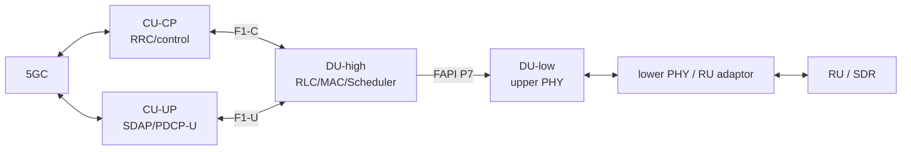

# OCUDU NR gNB 架构基线

**源码基线：** `6d44c2a5e5b2a81a4c67460b460ef99e789943cf`
**版本关系：** 包含首个公开版本 `v26.04` 后的 main 快照
**研究范围：** CU-CP、CU-UP、DU-high、DU-low/upper PHY、FAPI 与 scheduler；UE 排除。

## 架构结论

OCUDU 把 gNB 拆成可独立部署的 CU-CP、CU-UP 与 DU。官方架构把 DU-high 定义为 MAC/RLC，把 DU-low 定义为 upper PHY；固定源码进一步显示 MAC 与 PHY 之间存在方向明确的 FAPI fastpath translators。当前清单中的实现是模块化 C++/executor 架构，不包含 Aerial 式 `.cu` scheduler/PHY kernels。

## 模块输入、输出与执行边界

| 模块 | 输入 | 输出 | 执行位置 | 所有权与依赖 | 实时边界与固定源码证据 |
|---|---|---|---|---|---|
| gNB application | CLI/YAML、CU/DU unit 配置 | 组装后的 CU-CP、CU-UP、DU 实例与 services | CPU | OCUDU；C++ app framework、executors | [`gnb.cpp`](https://gitlab.com/ocudu/ocudu/-/blob/6d44c2a5e5b2a81a4c67460b460ef99e789943cf/apps/gnb/gnb.cpp) 是统一进程入口（E2）。 |
| CU-CP | NGAP、F1AP/E1AP/XnAP、UE/RRC control events | RRC/UE context、bearer coordination、CU-UP/DU control | CPU executors | OCUDU；ASN.1、timers、repositories | [`cu_cp_impl.cpp`](https://gitlab.com/ocudu/ocudu/-/blob/6d44c2a5e5b2a81a4c67460b460ef99e789943cf/lib/cu_cp/cu_cp_impl.cpp) 的 `cu_cp_impl::start`、NGAP/E1 repositories（E2）。 |
| DU-high | F1-C/U、slot indication、UL MAC indications、RRC cell config | MAC/RLC PDUs、scheduler results、F1 messages | CPU executors | OCUDU；F1AP、MAC、RLC、DU manager | [`du_high_impl.cpp`](https://gitlab.com/ocudu/ocudu/-/blob/6d44c2a5e5b2a81a4c67460b460ef99e789943cf/lib/du/du_high/du_high_impl.cpp) 构造 `f1ap`、`mac`、`du_mng`，并公开 slot/PDU handlers（E2）。 |
| Scheduler | UE/HARQ/CRC/CSI、cell/slice config、slot | DL/UL grants 与资源分配 | CPU per-cell executor | OCUDU scheduler library | [`cell_scheduler.cpp`](https://gitlab.com/ocudu/ocudu/-/blob/6d44c2a5e5b2a81a4c67460b460ef99e789943cf/lib/scheduler/cell_scheduler.cpp) 的 `cell_scheduler::run_slot`、`handle_crc_indication`（E2）。 |
| MAC→FAPI adaptor | MAC DL data、DL/UL scheduler results、slot completion | FAPI DL_TTI/UL_TTI/UL_DCI/TX data 请求 | CPU fastpath | OCUDU FAPI adaptor | [`mac_to_fapi_fastpath_translator.cpp`](https://gitlab.com/ocudu/ocudu/-/blob/6d44c2a5e5b2a81a4c67460b460ef99e789943cf/lib/fapi_adaptor/mac/p7/mac_to_fapi_fastpath_translator.cpp) 的 `on_new_*_scheduler_results`（E2）。 |
| FAPI→upper PHY adaptor | FAPI P7 requests | upper-PHY processor/controller calls；错误 indications | CPU fastpath | OCUDU FAPI adaptor | [`fapi_to_phy_fastpath_translator.cpp`](https://gitlab.com/ocudu/ocudu/-/blob/6d44c2a5e5b2a81a4c67460b460ef99e789943cf/lib/fapi_adaptor/phy/p7/fapi_to_phy_fastpath_translator.cpp) 的 `send_dl_tti_request`、`send_ul_tti_request`（E2）。 |
| DU-low / upper PHY | FAPI 派生 PDU、RX resource grid/symbols | DL resource grid、UL decode results/metrics | CPU workers/executors | OCUDU；upper-PHY processors、buffers/pools | [`du_low_impl.cpp`](https://gitlab.com/ocudu/ocudu/-/blob/6d44c2a5e5b2a81a4c67460b460ef99e789943cf/lib/du/du_low/du_low_impl.cpp) 持有 `upper_phy`；[`upper_phy_impl.cpp`](https://gitlab.com/ocudu/ocudu/-/blob/6d44c2a5e5b2a81a4c67460b460ef99e789943cf/lib/phy/upper/upper_phy_impl.cpp) 组装 DL/UL processor pools 与 notifier（E2）。 |

## 数据流

## 比较限制

- 官方文档说组件可独立部署，不代表本次在 Windows/no-radio 环境中已验证分布式部署。
- 清单未发现 CUDA 文件只能证明本次 24 文件架构证据集没有 CUDA；最终“全仓无 CUDA”结论仍需全树统计或本地 checkout。
- OCUDU 的 DU-low 是 upper PHY 软件组件；具体 lower-PHY、O-RAN 7.2 RU 或 SDR 路径取决于所选 radio/adapter，不能默认等同 Aerial FH Driver。
