# NR gNB 统一架构映射与术语口径

**基线日期：** 2026-07-20
**比较对象：** NVIDIA Aerial、Duranta/OAI、OCUDU；O-RAN SC O-DU High/Low 后续作为接口参照。
**目的：** 固定后续 CUDA 差异分析的“同层比较”口径，防止把产品名、目录名或部署单元误当作等价功能。

## 统一分层

| 统一层 | 输入 | 输出 | Aerial | OAI | OCUDU |
|---|---|---|---|---|---|
| CU 控制/用户面 | N2/N3、UE control/user traffic | F1-C/F1-U | 通常由外部/集成 L2/CU 提供，不属于 cuPHY 本体 | `openair2/RRC`、PDCP/SDAP、F1/E1 | `lib/cu_cp`、`lib/cu_up` |
| RLC/MAC | RRC/bearer state、UL indications、buffers | DL/UL grants、MAC PDUs、FAPI requests | 第三方 L2 + 可选 cuMAC GPU scheduler；cuMAC 不等于完整 RLC/MAC stack | `openair2/LAYER2/NR_MAC_gNB` 与 RLC | DU-high：MAC/RLC/scheduler |
| MAC-PHY 适配 | scheduler results、TB、slot timing | PHY channel PDUs、UL indications | L2 Adapter + NVIPC + cuPHY Driver；SCF FAPI | 内部 `NR_IF_Module`/`NR_Sched_Rsp_t`，另有 nFAPI 选项 | 显式 MAC/PHY FAPI P5/P7 fastpath adaptors |
| Upper PHY | FAPI/PDU、DL TB、UL frequency-domain IQ | DL grid/IQ、UL TB/CRC/UCI/measurements | cuPHY CUDA channel pipelines（GPU） | `openair1` 中的 NR PHY procedures（主要 CPU/SIMD 路径） | DU-low 的 `upper_phy` processors（CPU/executors） |
| Lower PHY / FH | resource grid、time-domain/FH data | radio samples 或 O-RAN packets | FH Driver；C-plane CPU/DPDK，U-plane GPU memory/DOCA 路径 | `openair1` + radio backend；可选 `radio/fhi_72` | lower-PHY/radio adaptor 取决于部署；DU-low 官方范围主要是 upper PHY |
| RU | O-DU C/U/S plane 或 baseband samples | RF TX/RX | 外部 O-RU | O-RU 或 SDR | O-RU 或 SDR |

## 三种实现的统一数据流

```mermaid
flowchart TB
    subgraph A["NVIDIA Aerial：异构 CPU/GPU"]
      A_CU["外部/集成 CU + RLC/MAC<br/>CPU"] --> A_AD["L2 Adapter + cuPHY Driver<br/>CPU"]
      A_CU <--> A_MCP["cuMAC-CP<br/>CPU"]
      A_MCP <--> A_MAC["cuMAC scheduler<br/>GPU"]
      A_AD <--> A_PHY["cuPHY upper PHY<br/>GPU"]
      A_AD -->|"C-plane"| A_FH["FH/NIC"]
      A_PHY <--> |"U-plane GPU memory"| A_FH
      A_FH <--> A_RU["O-RU"]
    end

    subgraph O["Duranta/OAI：仓内完整 gNB"]
      O_CU["RRC/PDCP/CU<br/>CPU"] --> O_MAC["RLC/MAC scheduler<br/>CPU"]
      O_MAC <--> O_PHY["NR L1<br/>CPU/SIMD"]
      O_PHY <--> O_FH["RF or O-RAN 7.2 backend"]
      O_FH <--> O_RU["RU/SDR"]
    end

    subgraph S["OCUDU：模块化 CU/DU + FAPI"]
      S_CU["CU-CP/CU-UP<br/>CPU"] --> S_DUH["DU-high RLC/MAC<br/>CPU"]
      S_DUH <--> S_FAPI["FAPI adaptors<br/>CPU fastpath"]
      S_FAPI <--> S_DUL["DU-low upper PHY<br/>CPU executors"]
      S_DUL <--> S_LP["lower PHY / radio adaptor"]
      S_LP <--> S_RU["RU/SDR"]
    end
```

## 必须保持的术语约束

1. **cuPHY 对比 upper PHY，而不是对比整个 OAI/OCUDU gNB。** 完整 gNB 对比必须把 CU、RLC/MAC、FAPI、FH/RU 一并列出。
2. **cuMAC 对比 scheduler 热路径，而不是对比完整 DU-high。** OCUDU DU-high 和 OAI L2 还包含 RLC、HARQ state、控制接口等职责。
3. **FAPI 是边界协议，不是执行位置。** Aerial FAPI 后可进入 GPU pipeline，OCUDU FAPI 后进入 CPU upper PHY；OAI 的主要同进程路径也可能不经过外部 FAPI transport。
4. **“GPU resident”需要逐缓冲区证明。** 只有在后续源码中同时确认分配位置、producer、consumer 和 copy/synchronization 后，才标记为 GPU 常驻。
5. **性能必须按配置归一化。** cell 数、带宽、SCS、TDD pattern、天线/层数、traffic model、deadline 与硬件任一不一致时，只能并列报告，不能计算直接倍数。

## Checkpoint B 审核表

- [x] 每个节点都有输入与输出。
- [x] Aerial 的 CPU/GPU 边界单独标识。
- [x] OAI 内部 MAC-PHY 接口未被误写成必然的外部 FAPI split。
- [x] OCUDU DU-low 与 upper PHY 的关系按官方 2026 文档表述。
- [x] CU/RLC/MAC 与 PHY/FH 的产品范围差异已显式呈现。
- [ ] 用户确认本术语口径后，进入 PUSCH/PDSCH 与 CUDA pipeline 深挖。

## 证据与可复现性

- 关键源码文件与 SHA-256：`data/inventory/source-inventory.csv`。
- 生成命令：`powershell -ExecutionPolicy Bypass -File scripts/source_inventory.ps1`。
- 清单是 **curated architecture evidence**，不是全仓语言统计；固定 commit、文件路径、字节数与 SHA-256 均可独立复核。
