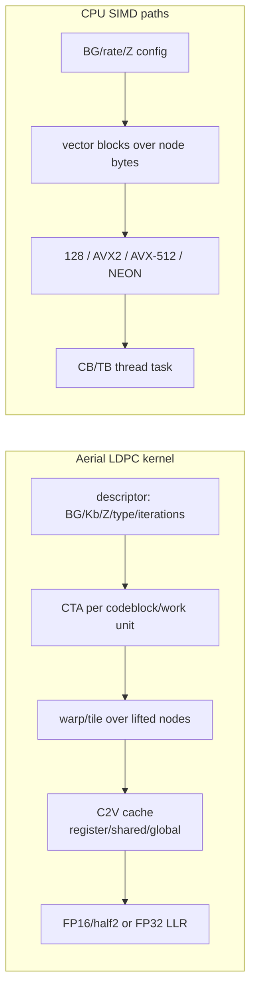

# NR gNB 信道编码实现档案

**冻结基线：** Aerial `29f5870`；Duranta/OAI `31ffb21`；OCUDU `6d44c2a`  
**范围：** gNB 中使用的 LDPC 与 Polar 编解码、rate matching/recovery；静态证据等级 E2。

## 核心判断

Aerial 的编码差异化由三层组成：CUDA 并行执行只是底座；按 base graph、lifting size、LLR 类型和 cache 位置生成专用 kernel 是算法/数据布局工程；把 LDPC 与 PUSCH/PDSCH 的 graph、streams 和 buffers 连接起来才形成端到端收益条件。OAI 与 OCUDU 同样进行了大量专用优化，但目标 ISA 是 CPU SIMD（AVX2/AVX-512、SIMDe、NEON）和线程池/executor。

因此，“GPU 对 CPU”只解释一部分差异。更准确的比较单位是：`算法变体 × 数值格式 × 数据布局 × 并行粒度 × pipeline 集成`。

## LDPC/Polar 路径

```mermaid
flowchart TB
  subgraph A["Aerial CUDA"]
    A0["TB / LLR descriptors"] --> A1["segmentation / rate matching or recovery"]
    A1 --> A2["dispatch by BG, Kb, Z, LLR type"]
    A2 --> A3["LDPC CUDA kernels\nregister/shared/global C2V variants"]
    A3 --> A4["CRC/result + graph event"]
    A5["Polar input"] --> A6["GPU encode+rate-match or list/non-list decode"]
  end
  subgraph O["OAI CPU"]
    O0["TB / int8 LLR"] --> O1["segment + rate match/recovery"]
    O1 --> O2["BG/rate/lifting dispatch"]
    O2 --> O3["128/AVX2/AVX-512 CN/BN processing"]
    O3 --> O4["CRC / thread-pool completion"]
    O5["Polar input"] --> O6["C encoder / SCL decoder"]
  end
  subgraph S["OCUDU CPU"]
    S0["bit_buffer / LLR spans"] --> S1["segmenter + rate matcher/dematcher"]
    S1 --> S2["generic/AVX2/AVX-512/NEON factory choice"]
    S2 --> S3["layered LDPC + syndrome early stop option"]
    S3 --> S4["codeblock executor/notifier"]
    S5["Polar input"] --> S6["SSC-style processor components"]
  end
```

## 实现维度对照

| 维度 | Aerial | OAI | OCUDU |
|---|---|---|---|
| LDPC encoder | `ldpc_encode_in_bit_kernel`；BG/Z 专用 dispatch；支持 batched TB descriptors | 分 BG/Z 生成的 C/SIMD encoder 文件；PDSCH 可由 thread pool 分发 | generic/AVX2/NEON encoder 实现，经 factory/processor 使用 |
| LDPC decoder | CUDA `ldpc2_kernel` 系列，固定/动态 schedule，C2V cache 有 register/shared/global 变体 | `nrLDPC_decoder_core`，按 BG/rate 选择 128/AVX2/AVX-512 CN/BN 处理 | layered decoder；generic/AVX2/AVX-512/NEON；LLR 为饱和整数抽象 |
| LLR/量化 | 已定位 FP32 与 FP16/`__half2` decoder dispatch | `int8_t` LLR 与整数 SIMD | `log_likelihood_ratio`（底层整数）与 SIMD spans |
| lifting size | kernel/template 和 launch 参数按 Z 特化，Z 最大值 384 | 大量按 Z 生成的 encoder/CN/BN 文件 | graph/LUT + runtime lifting size；SIMD node storage 对齐 |
| rate match/recovery | DL 融合到 modulation；UL 独立 CUDA rate-matching/recovery | `nr_rate_matching.c` 含 AVX-512VBMI 与 SIMDe 128 path | 独立 matcher；dematcher 有 AVX2/AVX-512/NEON，含 HARQ soft combine |
| early termination | 当前 LDPC kernel 证据显示循环至 `max_iterations`；未把 syndrome early stop 记为已证实能力 | 需按 decoder 配置/CRC 流程进一步确认，本文不评分 | constructor 显式接收 `cfg_early_stop_syndrome`，实现 `check_syndrome` |
| batch/并发 | encoder 接收 batched TB；PDSCH 按配置分 LDPC streams；PUSCH 可按 CB/transport block 并行 | TB/CB jobs 进入 thread pool | codeblock task 可由 executor defer；processor pools 控制实例 |
| Polar | CUDA encoder 把 encode+rate match 组合；decoder 有 half2、cooperative groups、list/non-list 分支 | C encoder 与 SCL decoder，使用 host arrays/double LLR | C++ Polar components；decoder 实现 simplified/SSC nodes |

## 数据布局与并行粒度

## 差异归因

| Aerial 特征 | 归因 | 理由 | 证据 |
|---|---|---|---|
| thousands of GPU threads / CTA/warp mapping | `cuda_intrinsic` | CUDA execution hierarchy 直接提供并行载体 | E2 |
| streams、events、graph node launch | `cuda_runtime` | 属于 CUDA runtime orchestration | E2 |
| FP16/`half2` LLR 与 vectorized device math | `cuda_intrinsic` + `algorithm_redesign` | 指令能力是平台属性，选择量化与布局是实现决策 | E2 |
| BG/Kb/Z 专用模板与 SM-specific cubin wrappers | `algorithm_redesign` + `engineering` | 需要针对 NR 参数空间生成和维护多套 kernel | E2 |
| register/shared/global C2V cache 变体 | `hardware_resource` + `algorithm_redesign` | 利用寄存器/共享内存层级并按配置选型 | E2 |
| batched TB descriptors | `data_path` + `engineering` | 通过批处理摊薄编排与描述符成本 | E2 |
| LDPC 与 PDSCH/PUSCH graph/streams 连接 | `data_path` + `cuda_runtime` | 避免把独立 benchmark 的加速误当成整槽收益 | E2 |
| DL rate matching 到 modulation 融合 | `algorithm_redesign` + `data_path` | 减少中间物化/launch 的潜力来自跨阶段重构 | E2；收益待 E4 |

## 能力评分（非性能分数）

评分只表示冻结源码中该类工程的可见深度：0 未定位，1 通用实现，2 ISA/并行优化，3 与 gNB 热路径深度集成。

| 能力 | Aerial | OAI | OCUDU | 依据与限制 |
|---|---:|---:|---:|---|
| LDPC 专用优化 | 3 | 2 | 2 | 三者均有专用实现；Aerial 进一步连接 CUDA graph/streams |
| 多数值格式/ISA | 3 | 2 | 2 | Aerial FP16/FP32 + SM wrappers；对照项目为多 CPU ISA |
| rate-match 优化 | 3 | 2 | 2 | Aerial DL 跨阶段融合；OAI/OCUDU 有显式 SIMD path |
| Polar 专用优化 | 2 | 1 | 1 | Aerial GPU list/non-list 与 half2；不表示标准能力更完整 |
| early-stop 可见性 | 1 | 1 | 2 | OCUDU 显式 syndrome early-stop；Aerial 当前只确认 max-iteration loop |
| 热路径集成 | 3 | 2 | 2 | 评分不代表快慢，只代表静态集成深度 |

## 固定提交证据

### Aerial

- [`ldpc_encode.cu`](https://github.com/NVIDIA/aerial-cuda-accelerated-ran/blob/29f5870fd84b0176df48b40667c1b8f1740e6d09/cuPHY/src/cuphy/error_correction/ldpc_encode.cu)：`ldpc_encode_in_bit_kernel`、Z dispatch、batched TB、graph node params。
- [`ldpc2_global.cu`](https://github.com/NVIDIA/aerial-cuda-accelerated-ran/blob/29f5870fd84b0176df48b40667c1b8f1740e6d09/cuPHY/src/cuphy/error_correction/ldpc2_global.cu)：FP32/FP16 dispatch、fixed/dynamic iterator 与 C2V cache variants。
- [`ldpc2_kernel.cuh`](https://github.com/NVIDIA/aerial-cuda-accelerated-ran/blob/29f5870fd84b0176df48b40667c1b8f1740e6d09/cuPHY/src/cuphy/error_correction/ldpc2_kernel.cuh)：迭代 loop 与 schedule 模板。
- [`polar_decoder.cu`](https://github.com/NVIDIA/aerial-cuda-accelerated-ran/blob/29f5870fd84b0176df48b40667c1b8f1740e6d09/cuPHY/src/cuphy/polar_decoder/polar_decoder.cu)、[`polar_encoder.cu`](https://github.com/NVIDIA/aerial-cuda-accelerated-ran/blob/29f5870fd84b0176df48b40667c1b8f1740e6d09/cuPHY/src/cuphy/polar_encoder/polar_encoder.cu)：GPU Polar decode/list handling 与 encode+rate-match。

### OAI

- [`nrLDPC_decoder.c`](https://github.com/duranta-project/openairinterface5g/blob/31ffb21a8204ae9706a88eb08606a80fc8eafb3e/openair1/PHY/CODING/nrLDPC_decoder/nrLDPC_decoder.c)：128/AVX2/AVX-512 CN/BN dispatch。
- [`nr_rate_matching.c`](https://github.com/duranta-project/openairinterface5g/blob/31ffb21a8204ae9706a88eb08606a80fc8eafb3e/openair1/PHY/CODING/nrLDPC_coding/nrLDPC_coding_segment/nr_rate_matching.c)：AVX-512VBMI/SIMDe rate-matching data rearrangement。
- [`nr_polar_decoder.c`](https://github.com/duranta-project/openairinterface5g/blob/31ffb21a8204ae9706a88eb08606a80fc8eafb3e/openair1/PHY/CODING/nrPolar_tools/nr_polar_decoder.c)、[`nr_polar_encoder.c`](https://github.com/duranta-project/openairinterface5g/blob/31ffb21a8204ae9706a88eb08606a80fc8eafb3e/openair1/PHY/CODING/nrPolar_tools/nr_polar_encoder.c)：host SCL/encoding path。

### OCUDU

- [`ldpc_decoder_impl.cpp`](https://gitlab.com/ocudu/ocudu/-/blob/6d44c2a5e5b2a81a4c67460b460ef99e789943cf/lib/phy/upper/channel_coding/ldpc/ldpc_decoder_impl.cpp)：layered decoder、syndrome check 与 runtime lifting size。
- [`ldpc_decoder_avx512.cpp`](https://gitlab.com/ocudu/ocudu/-/blob/6d44c2a5e5b2a81a4c67460b460ef99e789943cf/lib/phy/upper/channel_coding/ldpc/ldpc_decoder_avx512.cpp)：AVX-512 node operations。
- [`ldpc_rate_dematcher_avx512_impl.cpp`](https://gitlab.com/ocudu/ocudu/-/blob/6d44c2a5e5b2a81a4c67460b460ef99e789943cf/lib/phy/upper/channel_coding/ldpc/ldpc_rate_dematcher_avx512_impl.cpp)：soft combine 与 modulation-specific deinterleave。
- [`polar_decoder_impl.cpp`](https://gitlab.com/ocudu/ocudu/-/blob/6d44c2a5e5b2a81a4c67460b460ef99e789943cf/lib/phy/upper/channel_coding/polar/polar_decoder_impl.cpp)：simplified-node Polar decode。

## 后续实机验证

- 按相同 BG、Z、code rate、CB 数、LLR 量化和最大迭代数比较吞吐与尾时延。
- 分别测独立 codec、含 rate matching、含 H2D/D2H、整 PUSCH/PDSCH 四个边界。
- 记录实际迭代数；若实现策略不同，不能只比较每 TB 时间。
- 用 Nsight/CPU profiler 量化 cache variant、occupancy、DRAM bytes、SIMD utilization 与 executor idle。
