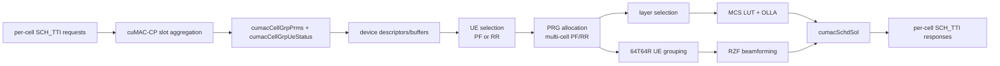

# cuMAC 与 OAI/OCUDU CPU Scheduler 比较档案

**冻结基线：** Aerial `29f5870`；Duranta/OAI `31ffb21`；OCUDU `6d44c2a`  
**范围：** NR gNB scheduler 热路径。cuMAC 只与 scheduler/资源分配职责比较，不等同于完整 MAC/RLC。

## 核心结论

cuMAC 同时包含两类价值，但证据强度不同：

1. **相同或相近算法的并行执行。** Aerial 提供 PF/RR、UE selection、PRG allocation、layer selection、MCS/OLLA 的 GPU 与 CPU reference 实现，可以做结果一致性检查。这是“更快执行同类算法”的 E2 实现证据；速度仍需 E4。
2. **扩大联合优化空间。** cuMAC 的输入以 coordinated cell group 为单位，GPU kernels 同时展开 cell、UE、PRG、antenna/layer，并把干扰矩阵、MU-MIMO grouping、RZF 和 MCS 相邻执行。这是“允许更复杂联合优化”的 E2 结构证据；是否在 deadline 内带来更优网络效用仍需 E4。

OAI 和 OCUDU 的冻结 scheduler 都不是简单串行基线：OAI 具有候选集、可插拔 DL policy、PF/beam/MCS/RB allocation 和 HARQ 优先级；OCUDU 具有 slice-aware candidate scheduling、QoS/PF policy、typed resource-grid allocator、link adaptation 和 OLLA。主要差异是它们的选择与资源分配运行在 CPU 数据结构和循环/排序上，而不是 coordinated-cell GPU kernels。

## cuMAC cell-group 数据流

`cumac_cp_handler` 按槽聚合多个 cell 消息，构建 cell-group 参数和 GPU/host buffers；任务完成 callback 再逐 cell 发送 response。上一槽任务未完成时存在显式 drop/error 路径，因此 GPU scheduler 并没有消除实时系统的背压问题，只是改变了热路径的执行位置。

## 输入、状态与输出

| 类别 | cuMAC cell-group 字段/语义 | OAI | OCUDU |
|---|---|---|---|
| cell规模 | `nCell`，最大常量 `maxNumCoorCells_=20` | MAC instance/common channel逐 cell调度 | cell scheduler + slice candidates；每 cell allocator |
| UE规模 | `nActiveUe`、`numUeSchdPerCellTTI`，active UE上限常量1024/cell | `NR_UE_info_t` candidates与UE sched control | `ue_repository`、bounded candidate spans |
| 业务状态 | `bufferSize`、priority、average rate、new/reTx | RLC buffer status、HARQ lists、average throughput | pending bytes、QoS history、slice UE repository、HARQ handles |
| 无线状态 | WB/subband SINR、CQI/RI/PMI、SRS channel、noise、power | CSI/RI/PMI、CQI/BLER、beam state | channel-state manager、CQI、layers、link-adaptation controller |
| 资源维度 | `nPrbGrp`、cell masks、PRG allocation、layer | VRB maps、TDA、RB interval、beam | CRB/VRB intervals、PDCCH/PDSCH/PUSCH/UCI allocators |
| 输出 | selected UE、PRG range/mask、layer、MCS、beam weights | per-UE grants与NFAPI/内部 scheduler response | typed DL/UL grants写入 cell resource allocator result |

## 三种执行模型

## 同口径复杂度变量

以下不是严格渐近证明，而是用于实验归一化的 workload dimensions：

| 变量 | cuMAC 中的展开 | OAI/OCUDU 对照 | 必须固定 |
|---|---|---|---|
| `C`：协调 cell 数 | kernel descriptor 的 `nCell/totNumCell` | 通常按 cell scheduler 运行；跨 cell协调方式需另列 | cell数、邻区/干扰输入 |
| `U`：active/candidate UE | PF/RR UE selection，最多常量1024/cell | candidate array/span、policy sorting | active、buffered、eligible UE数量 |
| `P`：PRB/PRG 数 | `nPrbGrp`，最多273；cell×PRG blocks | VRB/CRB bitmap或interval扫描 | 带宽、PRG/RBG粒度、保留资源 |
| `L`：layer/antenna | SINR、layer selection、MU grouping、RZF | RI/PMI/layer与precoder配置 | BS/UE天线、最大层数 |
| `K`：MU pairing/search | candidate group、相关性与DMRS约束 | 未定位同口径GPU式联合枚举 | candidate pool、group上限、算法策略 |
| `H`：HARQ/reTx | last-Tx allocation/MCS/layer与newData标志 | reTx优先、HARQ process state | reTx比例、round、固定MCS规则 |

## 模块级比较

| 阶段 | cuMAC | OAI | OCUDU |
|---|---|---|---|
| UE selection | PF/RR CUDA kernels；buffer、average rate、priority/newData输入 | DL candidate构建与PF排序；reTx优先 | slice-aware candidate spans；pre-policy RR group减少候选集 |
| PRB/PRG allocation | multi-cell CUDA kernels按cell×PRG评估post-EQ SINR/PF metric | default policy扫描VRB maps、分配连续RB；policy可替换 | `ue_cell_grid_allocator`协调PDCCH、PDSCH/PUSCH、UCI和CRB intervals |
| layer/precoding | GPU layer selection；64T64R grouping + RZF | RI/PMI default policy与beam allocation | channel-state layers与precoding配置进入grant/modulator |
| MCS/OLLA | CQI或SINR LUT；kernel内更新per-UE OLLA delta | BLER adaptation/default MCS policy | link-adaptation controller + `olla_algorithm` |
| QoS/slice | PF average rate、priority weights、buffer state；完整RLC/slice职责仍在外部L2 | RLC buffer与scheduler policy；切片能力依配置/实现 | 明确slice repository、intra-slice scheduler、QoS/PF policy |
| DRL | DRL MCS代码位于`examples/ml`；未定位生产热路径接入 | 本轮未定位生产DRL scheduler | 本轮未定位生产DRL scheduler |

## “执行加速”与“算法空间扩展”分离

| 能力 | 类型 | 已有证据 | 当前不能声称 |
|---|---|---|---|
| GPU PF/RR、layer/MCS与CPU reference对应 | 更快执行相近算法的条件 | GPU/CPU同名组件与testbench result check，E2 | 不能声称具体加速倍数 |
| cell×UE×PRG并行 | 执行加速 + 搜索空间扩展 | kernel索引与descriptor维度，E2 | 不能声称所有维度线性扩展 |
| 多cell干扰矩阵进入PF allocation | 算法空间扩展 | `multiCellSchedulerKernel_*MmseIrc`，E2 | 不能声称一定改善小区边缘吞吐 |
| 64T64R grouping/RZF/MCS相邻pipeline | 算法空间扩展 + data path | 固定源码pipeline示例与kernels，E2 | 不能声称生产配置下全程零拷贝 |
| GPU OLLA | 相同控制律并行化 | MCS kernel更新UE delta，E2 | 不能声称收敛性优于CPU OLLA |
| DRL MCS | 潜在算法扩展 | examples目录代码，E2位置证据 | 不能标记为production-integrated能力 |

## CPU reference 与 benchmark 审计

### 可以确认

- `multiCellSchedulerCpu`、`multiCellUeSelectionCpu`、`multiCellLayerSelCpu`、`mcsSelectionLUTCpu` 为GPU模块提供CPU reference。
- `examples/testBench.cpp` 可选择CPU RR baseline或CPU multi-cell PF reference，并运行GPU对应模块。
- 64T64R示例调用GPU sort/group/beamform/MCS后执行 `validateSchedSol` 与 `compareCpuGpuAllocSol`。
- 多个模块提供受编译宏控制的重复kernel计时，常见重复次数为1000。

### 为什么不是本地性能证据

- 当前没有NVIDIA GPU环境，示例无法执行。
- testbench在多个阶段显式 `cudaStreamSynchronize`，其同步结构不等同于production slot pipeline。
- 局部kernel宏计时可能排除setup、descriptor copy、前后处理、result return和slot aggregation。
- CPU baseline有时为RR，有时为multi-cell PF reference；若不区分会把算法差异误记为硬件加速。
- 示例生成channel/traffic或读取HDF5 test vector；输入分布与真实gNB负载必须单独说明。

因此，现阶段benchmark只记为 **E3方法证据**：它证明未来如何测和如何检查一致性，不生成任何本机实测结论。

## 能力评分（非性能评分）

0表示本轮未定位，1表示基础能力，2表示成熟CPU/模块化实现，3表示跨维度GPU联合实现。分数不表示标准完整性或运行速度。

| 能力 | cuMAC | OAI | OCUDU | 依据 |
|---|---:|---:|---:|---|
| PF/RR与HARQ-aware调度 | 3 | 2 | 2 | 三者都有；cuMAC以GPU cell-group执行 |
| 多cell联合干扰感知 | 3 | 1 | 1 | cuMAC kernel显式遍历协调cell和干扰矩阵 |
| PRB/layer/MCS联合热路径 | 3 | 2 | 2 | cuMAC相邻GPU模块；CPU项目有完整分阶段pipeline |
| MU-MIMO candidate grouping | 3 | 1 | 1 | cuMAC 64T64R专用kernels；对照未定位等价联合链 |
| slice/QoS职责完整性 | 1 | 2 | 3 | cuMAC不是完整DU-high；OCUDU显式slice-aware架构 |
| CPU reference/一致性工具 | 3 | 1 | 1 | cuMAC仓库提供同名CPU模块和comparison hooks |
| DRL production integration | 0 | 0 | 0 | cuMAC仅定位examples；其余本轮未定位 |
| 实测deadline/加速倍数 | 0 | 0 | 0 | 无统一硬件与负载E4 |

## 固定提交证据

### Aerial/cuMAC

- [`api.h`](https://github.com/NVIDIA/aerial-cuda-accelerated-ran/blob/29f5870fd84b0176df48b40667c1b8f1740e6d09/cuMAC/src/api.h)：cell-group/UE状态/solution结构和规模常量。
- [`cumac_cp_handler.cpp`](https://github.com/NVIDIA/aerial-cuda-accelerated-ran/blob/29f5870fd84b0176df48b40667c1b8f1740e6d09/cuMAC-CP/src/cumac_cp_handler.cpp)：per-cell slot聚合、task buffers、GPU/CPU模式、callback逐cell返回和drop路径。
- [`multiCellUeSelection.cu`](https://github.com/NVIDIA/aerial-cuda-accelerated-ran/blob/29f5870fd84b0176df48b40667c1b8f1740e6d09/cuMAC/src/4T4R/multiCellUeSelection.cu)：PF UE selection、heterogeneous cell配置和计时边界。
- [`multiCellScheduler.cu`](https://github.com/NVIDIA/aerial-cuda-accelerated-ran/blob/29f5870fd84b0176df48b40667c1b8f1740e6d09/cuMAC/src/4T4R/multiCellScheduler.cu)：跨cell/PRG MMSE-IRC/SVD/PF allocation kernels。
- [`mcsSelectionLUT.cu`](https://github.com/NVIDIA/aerial-cuda-accelerated-ran/blob/29f5870fd84b0176df48b40667c1b8f1740e6d09/cuMAC/src/4T4R/mcsSelectionLUT.cu)：CQI/SINR MCS和GPU OLLA更新。
- [`multiCellSchedulerCpu.cpp`](https://github.com/NVIDIA/aerial-cuda-accelerated-ran/blob/29f5870fd84b0176df48b40667c1b8f1740e6d09/cuMAC/src/4T4R/multiCellSchedulerCpu.cpp)：CPU reference算法结构。
- [`testBench.cpp`](https://github.com/NVIDIA/aerial-cuda-accelerated-ran/blob/29f5870fd84b0176df48b40667c1b8f1740e6d09/cuMAC/examples/testBench.cpp)：GPU/CPU setup、同步、traffic/channel输入和reference选择。
- [`multiCellMuMimoScheduler/main.cpp`](https://github.com/NVIDIA/aerial-cuda-accelerated-ran/blob/29f5870fd84b0176df48b40667c1b8f1740e6d09/cuMAC/examples/multiCellMuMimoScheduler/main.cpp)：64T64R GPU pipeline与solution comparison。

### OAI

- [`gNB_scheduler_dlsch.c`](https://github.com/duranta-project/openairinterface5g/blob/31ffb21a8204ae9706a88eb08606a80fc8eafb3e/openair2/LAYER2/NR_MAC_gNB/gNB_scheduler_dlsch.c)：buffer/HARQ状态、candidate与DL grant pipeline。
- [`gNB_scheduler_dlsch_default_policies.c`](https://github.com/duranta-project/openairinterface5g/blob/31ffb21a8204ae9706a88eb08606a80fc8eafb3e/openair2/LAYER2/NR_MAC_gNB/gNB_scheduler_dlsch_default_policies.c)：RI/PMI、TDA、beam、MCS、PF/RB allocation可插拔policy。
- [`gNB_scheduler_ulsch.c`](https://github.com/duranta-project/openairinterface5g/blob/31ffb21a8204ae9706a88eb08606a80fc8eafb3e/openair2/LAYER2/NR_MAC_gNB/gNB_scheduler_ulsch.c)：UL VRB、TDA、BSR/PHR、MCS/PRB约束。

### OCUDU

- [`ue_scheduler_impl.cpp`](https://gitlab.com/ocudu/ocudu/-/blob/6d44c2a5e5b2a81a4c67460b460ef99e789943cf/lib/scheduler/ue_scheduling/ue_scheduler_impl.cpp)：slot scheduler编排。
- [`intra_slice_scheduler.cpp`](https://gitlab.com/ocudu/ocudu/-/blob/6d44c2a5e5b2a81a4c67460b460ef99e789943cf/lib/scheduler/ue_scheduling/intra_slice_scheduler.cpp)：slice候选、reTx/newTx和grant数量边界。
- [`scheduler_time_qos.cpp`](https://gitlab.com/ocudu/ocudu/-/blob/6d44c2a5e5b2a81a4c67460b460ef99e789943cf/lib/scheduler/policy/scheduler_time_qos.cpp)：throughput history、QoS/PF priority与rate estimator。
- [`ue_cell_grid_allocator.cpp`](https://gitlab.com/ocudu/ocudu/-/blob/6d44c2a5e5b2a81a4c67460b460ef99e789943cf/lib/scheduler/ue_scheduling/ue_cell_grid_allocator.cpp)：PDCCH/PDSCH/PUSCH/UCI和CRB allocation的一致性边界。
- [`outer_loop_link_adaptation.h`](https://gitlab.com/ocudu/ocudu/-/blob/6d44c2a5e5b2a81a4c67460b460ef99e789943cf/lib/scheduler/support/outer_loop_link_adaptation.h)：target-BLER OLLA控制律与MCS边界处理。

## 未来实验设计要点

- 分成A/B两组：A组强制相同PF/RR与候选集，测纯执行差异；B组允许cuMAC多cell/MU-MIMO联合优化，测网络效用变化。
- 固定 `C/U/P/L/K/H`、traffic arrivals、channel/SRS、CQI delay、TDD pattern和deadline。
- 同时报出setup、H2D、kernels、D2H/callback及端到端slot latency，至少报告P50/P95/P99/max。
- 结果一致性必须按算法划分：bit-exact、相同UE/RB解、或objective差异；不能把合理tie-break差异视为错误。
- 网络效用至少包括throughput、5th-percentile UE、Jain fairness、BLER、reTx和deadline miss。
- CPU baseline必须注明RR、PF、QoS/slice policy及线程配置；GPU必须注明GPU型号、clock/power和并发cell/slot设置。
