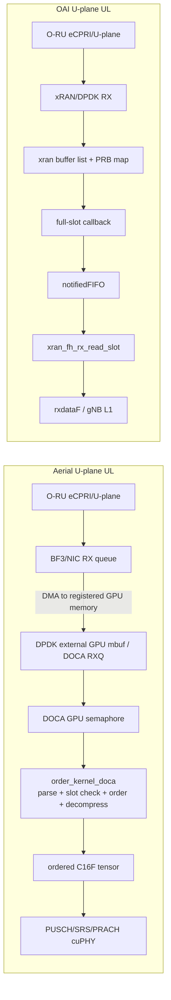
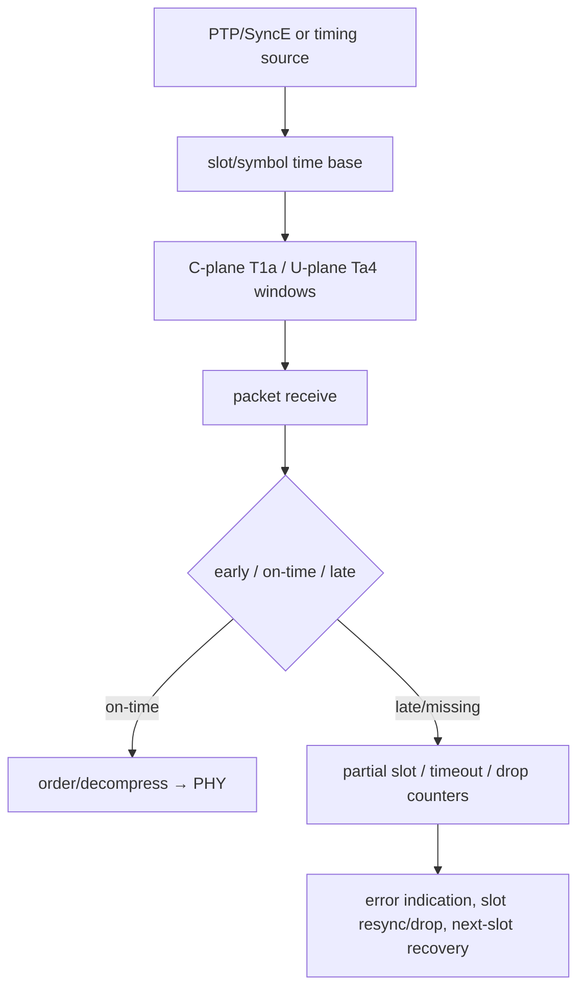

# O-RAN 7.2、GPUDirect 与实时数据路径档案

**冻结源码：** Aerial `29f5870`；Duranta/OAI `31ffb21`；O-RAN SC O-DU Low `6ef1d2b`  
**范围：** NR gNB/O-DU 的FH packet-to-PHY路径、ownership/copy/synchronization与deadline。性能数字不在本档案中审计。

## 核心结论

Aerial 的前传差异化不是“DPDK比socket快”，而是把高数据率U-plane的NIC DMA目标、packet queue/semaphore、重排、时窗分类和IQ解压放到GPU可访问内存与CUDA kernel中，使重排后的tensor可直接进入cuPHY。C-plane仍主要由CPU/DPDK负责。这是明确的异构数据路径重构。

OAI冻结路径使用O-RAN xRAN/DPDK库管理host-side buffer lists、PRB maps和full-slot callbacks，再通过FIFO唤醒OAI线程并把频域IQ交给L1。O-RAN SC O-DU Low提供xRAN compression、RX/TX、sync及FAPI/WLS参考组件，但不应被描述成与Aerial完全等价的端到端gNB。

静态源码可以证明DMA映射、buffer ownership和timeout/error机制，不能证明具体系统已满足T1a/Ta4或slot deadline。

## packet-to-PHY路径



## Aerial buffer ownership与同步

| 阶段 | ownership/地址域 | 同步 | 固定源码证据 |
|---|---|---|---|
| RX mempool建立 | CUDA device memory或host-pinned fallback注册为DPDK external memory | 初始化时register/map | `rte_extmem_register`、`rte_dev_dma_map`、`rte_pktmbuf_pool_create_extbuf` |
| NIC→buffer | NIC DMA到已map的GPU buffer | DOCA RX queue/semaphore | `doca_gpu_dev_eth_rxq_recv`、GPU semaphore packet info |
| packet处理 | GPU order kernel读取packet地址 | persistent/ping-pong kernel和semaphore index | `order_kernel_doca` |
| 时窗分类 | GPU按packet timestamp与slot/symbol阈值分类 | device global timer、Ta4 min/max | `early_rx_packets`、`on_time_rx_packets`、`late_rx_packets` |
| 重排/解压 | GPU解析eAxC/section/symbol并写PUSCH/SRS/PRACH buffers | ordered-PRB counters、GDR flags/events | `gpu_blockFP.h`、`gpu_fixed.h`、`pusch_ordered_prbs` |
| PHY交付 | cuPHY driver将ordered tensor绑定到channel input | CUDA events/phase streams | Task 5中`pTDataRx`路径 |
| DL发送 | GPU或CPU准备U-plane packets；C-plane/部分TX走DPDK | compression event、copy stream、TX completion | `GpuComm::cpu_send`、`gpu_comm_pre_prepare_send_doca` |

注意：`GpuMempool`含host-pinned fallback以及某些D2H packet-copy逻辑，因此不能把整个FH驱动无条件标记为“零拷贝”。正确结论是：代码实现了NIC DMA到GPU memory和GPU-side packet processing路径，实际是否启用由NIC、CUDA/DPDK/DOCA配置和运行模式决定。

## OAI与O-RAN SC参考路径

| 机制 | OAI | O-RAN SC O-DU Low参考 |
|---|---|---|
| packet I/O | xRAN/DPDK库；OAI绑定xRAN handles和buffer lists | `fhi_lib`的xRAN RX/TX实现 |
| buffer | `xran_bm_init`/`xran_bm_allocate_buffer`，按antenna/slot/symbol分配flat buffers | xRAN mbuf/PRB map数据结构 |
| compression | ARM RAN acceleration BFP 8/9/14-bit分支；其他平台依xRAN实现 | `xran_compression.cpp`等 |
| slot完成 | xRAN full-slot callback，汇集RU/port后push FIFO | xRAN callbacks/counters与timing window |
| L1交付 | `xran_fh_rx_read_slot`填充`rxdataF` | FAPI/WLS连接MAC/PHY，不代表OAI自身调用链 |
| 错误可见性 | early/late/corrupt/duplicate、eCPRI/CP/UP/PUSCH/PRACH drop counters | xRAN RX处理和同步API提供底层机制 |

## 实时机制与失败恢复



| 项目 | Aerial | OAI/O-RAN xRAN | 证据边界 |
|---|---|---|---|
| PTP/SyncE | 官方26.1能力表支持IEEE 1588v2 PTP/SyncE LLS-C3；packet descriptor携带PTP timestamp | xRAN timing source/sync API；OAI启动/停止timing source | E1+E2；未测clock error |
| CPU isolation | DPDK main lcore固定；官方real-time指南要求`isolcpus/nohz_full/rcu_nocbs` | OAI/xRAN启动worker cores并报告core time；部署需隔离 | 配置方法，不是性能结果 |
| NUMA | DPDK socket/NIC/GPU affinity影响DMA路径 | xRAN mbuf pools与NIC lcores依NUMA拓扑 | 本轮源码未形成自动最优NUMA结论 |
| GPU streams/events | nonblocking high-priority streams、packet-copy和compression events | 不适用GPU主路径；CPU FIFO/callback同步 | E2 |
| late/missing packet | GPU early/on-time/late counters；no-packet/partial-packet timeout与kernel exit status | xRAN early/late/corrupt/drop counters；slot mismatch调整/报错 | E2 |
| backlog/overrun | order counters、slot timeout；cuMAC-CP另有任务catch-up失败drop | FIFO queue length、frame jump、RX error与slot mismatch | E2 |
| MPS | 当前固定FH源码未定位必要依赖 | 不适用 | open question；不得假设开启 |
| MIG | 官方文档提供E2E on MIG配置/验证声明；FH源码路径本身未绑定MIG | 不适用 | vendor/config证据，性能待Task 9审计 |

## GPUDirect/BlueField反事实

“移除BlueField”与“禁用GPUDirect”不是同一件事。BlueField可被另一块经过适配和验证、同样支持DOCA/GPUNetIO或GDR的NIC替换；只有在direct DMA能力消失时，host bounce才是必然结果。

| GPUDirect路径优势 | 禁用GPUDirect后的直接影响 | 移除BF3但保留等价NIC/GDR能力 | 待测指标 |
|---|---|---|---|
| NIC直接DMA到GPU buffer | 增加host RX buffer和H2D copy；消耗CPU/DRAM/PCIe | 需重做驱动、DOCA/DPDK和timing资格验证，不必然增加copy | H2D bytes、CPU cores、PCIe throughput |
| GPU semaphore通知packet arrival | 通常改为CPU polling/doorbell后再触发GPU | 若替代NIC支持等价GPU semaphore，可维持模型 | wakeup jitter、poll cycles |
| GPU order+decompress紧邻DMA目标 | CPU重排/解压，或先copy packet再GPU处理 | 取决于替代NIC API和memory registration | packet-to-tensor latency、host BW |
| ordered tensor直接交cuPHY | host结果需H2D，或重新设计GPU stage | 可保留但需要验证address ownership | extra copies、event wait |
| CPU从高率U-plane卸载 | CPU负载、cache/NUMA压力和抖动上升 | 等价GDR NIC可保留卸载 | CPU utilization、P99/max latency |
| BF3提供PTP/SyncE与validated FH port | 需要独立timing NIC/PHC/SyncE方案 | 替代NIC必须重新验证LLS-C3和failover | phase/time error、holdover、failover |

这张表描述因果链，不声称BF3是实现GPUDirect的唯一NIC，也不声称host-bounce一定无法满足少量4T4R cell。

## 100 MHz理论频域IQ数据量

以下全部为 **`derived`**，不是线速测量，也不是Aerial性能声明。

### 假设

- NR FR1，100 MHz，30 kHz SCS，273 PRB。
- 每slot 14个OFDM symbols，slot时长0.5 ms，即2000 slots/s。
- 满带宽每个RE都携带一个复数IQ；忽略guard、空RE、DMRS/控制与TDD空符号差异。
- 频域O-RAN 7.2 payload-only：`273 × 12 × 14 = 45,864` complex RE/antenna/slot。
- 未压缩：I16+Q16，共32 bits/complex RE。
- BFP9简化payload：I9+Q9，共18 bits/complex RE；**未计每PRB exponent、section/eCPRI/Ethernet/VLAN、padding、fragmentation和FEC overhead**。
- “4T4R/64T64R”以4或64个eAxC/antenna streams计算单方向payload；不把DL和UL相加。

### 公式

```text
bytes_per_slot = 273 PRB × 12 RE/PRB × 14 symbols × antennas × bits_per_complex_RE / 8
payload_Gbit_per_s = bytes_per_slot × 2000 slots/s × 8 / 10^9
```

### 结果

| 配置 | IQ假设 | bytes/slot | payload GB/s | payload Gbit/s | 标记 |
|---|---:|---:|---:|---:|---|
| 4T4R | I16+Q16 | 733,824 | 1.467648 | 11.741184 | `derived` |
| 4T4R | I9+Q9 | 412,776 | 0.825552 | 6.604416 | `derived` |
| 64T64R | I16+Q16 | 11,741,184 | 23.482368 | 187.858944 | `derived` |
| 64T64R | I9+Q9 | 6,604,416 | 13.208832 | 105.670656 | `derived` |

64T64R的简化BFP9 payload已经约105.67 Gbit/s，加入headers/exponents/fragmentation后会更高；但真实TDD、符号方向、PRB allocation和压缩方式会降低或改变平均链路负载。因此该结果用于解释为什么GPU-direct data path在Massive-MIMO中更重要，不能直接用来选择端口速率或宣称实际线速。

## 固定提交证据

### Aerial

- [`gpu_mempool.cpp`](https://github.com/NVIDIA/aerial-cuda-accelerated-ran/blob/29f5870fd84b0176df48b40667c1b8f1740e6d09/cuPHY-CP/aerial-fh-driver/lib/gpu_mempool.cpp)：CUDA/host-pinned external memory、DPDK registration与NIC DMA map。
- [`fronthaul.cpp`](https://github.com/NVIDIA/aerial-cuda-accelerated-ran/blob/29f5870fd84b0176df48b40667c1b8f1740e6d09/cuPHY-CP/aerial-fh-driver/lib/fronthaul.cpp)：DPDK EAL/core affinity、DOCA GPU与timestamp setup。
- [`gpu_comm.cpp`](https://github.com/NVIDIA/aerial-cuda-accelerated-ran/blob/29f5870fd84b0176df48b40667c1b8f1740e6d09/cuPHY-CP/aerial-fh-driver/lib/gpu_comm.cpp)：CUDA streams/events、GPU/CPU TX路径及copy fallback。
- [`gpu_comm_doca.cu`](https://github.com/NVIDIA/aerial-cuda-accelerated-ran/blob/29f5870fd84b0176df48b40667c1b8f1740e6d09/cuPHY-CP/aerial-fh-driver/lib/gpu_comm_doca.cu)：DOCA GPUNetIO GPU TX preparation。
- [`order_cuda_kernels.cu`](https://github.com/NVIDIA/aerial-cuda-accelerated-ran/blob/29f5870fd84b0176df48b40667c1b8f1740e6d09/cuPHY-CP/cuphydriver/src/uplink/order_cuda_kernels.cu)：GPU RX、slot validation、early/late、order/decompression与timeout。
- [`order_entity.cpp`](https://github.com/NVIDIA/aerial-cuda-accelerated-ran/blob/29f5870fd84b0176df48b40667c1b8f1740e6d09/cuPHY-CP/cuphydriver/src/uplink/order_entity.cpp)：GDR counters/buffers、events和lost-PRB metrics。

### OAI

- [`oaioran.c`](https://github.com/duranta-project/openairinterface5g/blob/31ffb21a8204ae9706a88eb08606a80fc8eafb3e/radio/fhi_72/oaioran.c)：xRAN callback、FIFO、packet counters和slot handoff。
- [`oran-init.c`](https://github.com/duranta-project/openairinterface5g/blob/31ffb21a8204ae9706a88eb08606a80fc8eafb3e/radio/fhi_72/oran-init.c)：xRAN buffer pools、PRB maps、antenna/slot/symbol allocation。
- [`oran_isolate.c`](https://github.com/duranta-project/openairinterface5g/blob/31ffb21a8204ae9706a88eb08606a80fc8eafb3e/radio/fhi_72/oran_isolate.c)：timing source、worker lifecycle、RX/TX slot与resync行为。
- [`armral_bfp_compression.c`](https://github.com/duranta-project/openairinterface5g/blob/31ffb21a8204ae9706a88eb08606a80fc8eafb3e/radio/fhi_72/armral_bfp_compression.c)：BFP 8/9/14-bit compression/decompression。

### O-RAN SC参考

- [`xran_rx_proc.c`](https://github.com/o-ran-sc/o-du-phy/blob/6ef1d2b70db585e351b9cd35c6054c1b249a7465/fhi_lib/lib/src/xran_rx_proc.c)、[`xran_tx_proc.c`](https://github.com/o-ran-sc/o-du-phy/blob/6ef1d2b70db585e351b9cd35c6054c1b249a7465/fhi_lib/lib/src/xran_tx_proc.c)：xRAN RX/TX reference。
- [`xran_compression.cpp`](https://github.com/o-ran-sc/o-du-phy/blob/6ef1d2b70db585e351b9cd35c6054c1b249a7465/fhi_lib/lib/src/xran_compression.cpp)：compression reference。
- [`xran_sync_api.c`](https://github.com/o-ran-sc/o-du-phy/blob/6ef1d2b70db585e351b9cd35c6054c1b249a7465/fhi_lib/lib/src/xran_sync_api.c)：timing synchronization API。

### 官方部署证据

- [Aerial 26.1 5G gNB features](https://docs.nvidia.com/aerial/cuda-accelerated-ran/latest/cubb/features_and_arch/features_for_5g_gnb.html)：PTP/SyncE LLS-C3与FH能力。
- [Aerial real-time applications](https://docs.nvidia.com/aerial/framework/latest/developer_guide/real_time_apps.html)：release build、CPU isolation、PTP和DOCA GPUNetIO方法要求。
- [Aerial fronthaul tutorial](https://docs.nvidia.com/aerial/framework/latest/tutorials/generated/fronthaul_tutorial.html)：C-plane DPDK、U-plane GPUNetIO及validated GH200/BF3拓扑。

## 后续实机验证

- 同一流量分别运行direct-GPU、host-pinned bounce和CPU order/decompress，捕获NIC→tensor P50/P95/P99/max。
- 逐段记录NIC DMA bytes、host DRAM bytes、PCIe/NVLink bytes、H2D/D2H copies、CPU poll cycles和GPU stalls。
- 注入early/late/lost/corrupt/duplicate packets，核对counter、slot drop、error indication和下槽恢复。
- 验证PTP失锁、dual-port failover、holdover以及clock step/slew对Ta4分类的影响。
- 按NUMA/NIC/GPU拓扑、core isolation、MIG/MPS开关分别保存环境manifest，不能跨环境合并性能数字。
