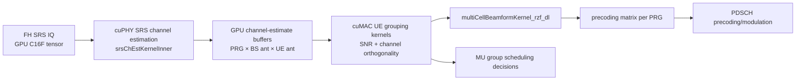
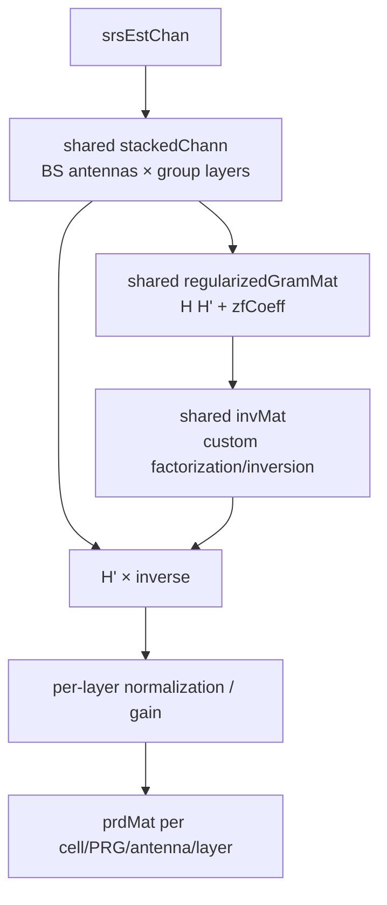

# NR gNB Massive-MIMO / 64T64R 实现档案

**冻结基线：** Aerial `29f5870`；Duranta/OAI `31ffb21`；OCUDU `6d44c2a`  
**范围：** SRS/CSI、信道矩阵、UE grouping、RZF/precoding 与波束权重。64T64R 是 Aerial 源码目录/配置能力的归因，不是三项目共同认证配置。

## 核心判断

Aerial 最明显的 64T64R 差异化不是某一个矩阵乘法 API，而是一条相邻 GPU stages 的集成链：cuPHY 在 GPU 上生成 SRS channel estimates，cuMAC 的 UE grouping kernels 直接按天线维度计算信道相关性并分组，随后自定义 RZF kernel 在 shared memory 中构造 stacked channel、regularized Gram matrix、inverse 和 precoding weights。

在已追踪的 `multiCellBeamform.cu` 中，RZF 是自定义 CUDA kernel，未发现 cuBLAS/cuSolver 调用；SRS 文件中 tensor-core MMA 段为注释代码，因此本档案不把 tensor cores 计为现行能力。OAI 与 OCUDU 均有 SRS/信道矩阵和波束/precoding 基础实现，但冻结证据不足以把它们标为等价的 64T64R GPU MU-MIMO pipeline。

## Aerial 数据与控制链

## 三项目功能链对照

| 阶段 | Aerial | OAI | OCUDU |
|---|---|---|---|
| SRS 接收 | `PhySrsAggr` 绑定 GPU C16F input tensor | `nr_fill_srs` 入队，`nr_get_srs_signal` 从 `c16_t` RX data 抽取 | SRS request/processor 从 resource grid 读取 |
| 信道估计 | CUDA `srsChEstKernelInner`，half2、cooperative groups，输出 device tensors | CPU SRS routines生成测量/估计；细节需继续拆分 | `srs_estimator_generic_impl::estimate` 生成 `srs_channel_matrix` |
| 信道矩阵布局 | cuMAC descriptor 以 cell/UE/PRG/UE-ant/BS-ant 索引 `srsEstChan` | host arrays/beam weights；当前未形成同口径 64T64R layout 结论 | typed `srs_channel_matrix(rx_ports, antenna_ports)`，wideband coefficients |
| UE grouping | 64T64R CUDA kernels使用 SRS SNR、inner product、norm、正交性、DMRS port约束 | scheduler 有 SRS/rank/beam相关逻辑；未定位等价 64T64R GPU grouping | scheduler/precoder能力需按具体 deployment继续追踪；未定位等价集成链 |
| 权重计算 | custom RZF CUDA kernel；构造 `H H' + λI` 并求 inverse/weights | `nr_beam_precoding` 应用已有 beam weights | generic channel precoder/resource-grid mapper应用 precoding配置 |
| 调度联动 | cuMAC grouping/sort/beamform 与 GPU scheduler相邻 | MAC/PHY CPU structures交互 | DU-high scheduler 与 DU-low/FAPI边界清晰，但信道矩阵回馈策略依部署 |

## RZF kernel 内部数据流

## 并行映射

| 工作维度 | Aerial 映射 | 意义 | 限制 |
|---|---|---|---|
| cell / PRG / UE group | grid/block 级并行 | 大量独立小矩阵问题适合批量并行 | 实际 grid geometry 需运行时捕获 |
| BS antenna | `threadIdx.x` 跨 `nBsAnt` 处理 inner products 和 weights | 64 天线维可直接形成并行轴 | shared-memory/occupancy 随 group layers变化 |
| group layer | shared arrays和二维 matrix index | 把小矩阵留在片上存储 | 最大 layer常量限制配置空间 |
| UE candidate | grouping kernel内 shared candidate arrays | 将 SNR、正交性、reTX/DMRS约束合并 | 算法质量需场景级仿真，静态代码不能证明 |
| SRS sequence/antenna | half2 + cooperative-group reduction | 高复用数据就近累加 | 已看到的 tensor-core段为注释，不计入能力 |

## CUDA 差异归因

| 差异化工作 | 归因 | 理由 | 证据 |
|---|---|---|---|
| 天线/PRG/UE group 大规模并行 | `cuda_intrinsic` | grid/block/thread 层级提供并行资源 | E2 |
| channel estimates保留为device tensor并传给cuMAC descriptors | `data_path` | 避免在算法段之间强制转为CPU矩阵 | E2；逐配置零拷贝待验证 |
| SRS half2与cooperative reductions | `cuda_intrinsic` + `algorithm_redesign` | 平台原语与数值/归约设计共同作用 | E2 |
| UE grouping整合SNR、相关性、DMRS和重传约束 | `algorithm_redesign` | 不是CUDA自动提供的调度算法 | E2 |
| custom shared-memory RZF | `algorithm_redesign` + `hardware_resource` | 手工组织小矩阵、inverse、normalization和片上存储 | E2 |
| GPU grouping → beamform → scheduler相邻集成 | `engineering` + `data_path` | 跨cuPHY/cuMAC descriptors与生命周期集成 | E2 |
| CUDA streams/launch与CPU descriptor setup | `cuda_runtime` | 运行时编排成本仍需测量 | E2 |
| 64T64R性能/容量 | `hardware_resource` + system design | 需要具体GPU、NIC、TDD和流量负载 | 当前E0，待E4 |

## 能力评分（非性能分数）

评分仅表示冻结源码中“该链路的可见集成深度”：0 未定位，1 基础组件，2 优化组件，3 端到端专用链。不能据此推导吞吐、覆盖或标准符合性。

| 能力 | Aerial | OAI | OCUDU | 理由 |
|---|---:|---:|---:|---|
| SRS channel estimation | 3 | 2 | 2 | 三者都有实现；Aerial为GPU tensor并接后续cuMAC链 |
| 明确64T64R数据布局 | 3 | 0 | 0 | 仅Aerial固定源码目录/descriptor直接显示；0表示本轮未定位 |
| MU UE grouping | 3 | 1 | 1 | Aerial有专用CUDA kernels；对照项目仅确认相关调度基础 |
| RZF/矩阵权重生成 | 3 | 1 | 1 | Aerial有custom RZF kernel；对照仅确认beam/precoding组件 |
| PHY到scheduler的GPU驻留潜力 | 3 | 0 | 0 | Aerial device buffers/descriptors可见；是否零拷贝待E4 |
| 实测64T64R deadline | 0 | 0 | 0 | 无统一硬件环境，禁止以文档或代码替代测量 |

## 固定提交证据

### Aerial

- [`physrs_aggr.cpp`](https://github.com/NVIDIA/aerial-cuda-accelerated-ran/blob/29f5870fd84b0176df48b40667c1b8f1740e6d09/cuPHY-CP/cuphydriver/src/uplink/physrs_aggr.cpp)：SRS GPU input/output tensors、pinned reports 与 channel-estimate buffers。
- [`srs_chEst.cu`](https://github.com/NVIDIA/aerial-cuda-accelerated-ran/blob/29f5870fd84b0176df48b40667c1b8f1740e6d09/cuPHY/src/cuphy/srs_chEst/srs_chEst.cu)：`srsChEstKernelInner`、half2、cooperative reduction和输出布局。
- [`multiCellMuUeGrp.cu`](https://github.com/NVIDIA/aerial-cuda-accelerated-ran/blob/29f5870fd84b0176df48b40667c1b8f1740e6d09/cuMAC/src/64T64R/multiCellMuUeGrp.cu)：DL semi-static/dynamic与UL dynamic grouping kernels、SRS channel inner products。
- [`multiCellBeamform.cu`](https://github.com/NVIDIA/aerial-cuda-accelerated-ran/blob/29f5870fd84b0176df48b40667c1b8f1740e6d09/cuMAC/src/64T64R/multiCellBeamform.cu)：`multiCellBeamformKernel_rzf_dl`、shared-memory Gram/inverse/RZF/normalization。

### OAI

- [`srs_rx.c`](https://github.com/duranta-project/openairinterface5g/blob/31ffb21a8204ae9706a88eb08606a80fc8eafb3e/openair1/PHY/NR_TRANSPORT/srs_rx.c)：SRS queue、signal/noise extraction 与 antenna-port handling。
- [`gNB_scheduler_srs.c`](https://github.com/duranta-project/openairinterface5g/blob/31ffb21a8204ae9706a88eb08606a80fc8eafb3e/openair2/LAYER2/NR_MAC_gNB/gNB_scheduler_srs.c)：SRS scheduling/rank相关CPU逻辑与SIMDe计算。
- [`nr_beamforming.c`](https://github.com/duranta-project/openairinterface5g/blob/31ffb21a8204ae9706a88eb08606a80fc8eafb3e/openair1/PHY/MODULATION/nr_beamforming.c)：`nr_beam_precoding` 应用beam weights。

### OCUDU

- [`srs_estimator_generic_impl.cpp`](https://gitlab.com/ocudu/ocudu/-/blob/6d44c2a5e5b2a81a4c67460b460ef99e789943cf/lib/phy/upper/signal_processors/srs/srs_estimator_generic_impl.cpp)：resource grid到wideband `srs_channel_matrix`、noise/TA/RSRP估计。
- [`pdsch_modulator_impl.cpp`](https://gitlab.com/ocudu/ocudu/-/blob/6d44c2a5e5b2a81a4c67460b460ef99e789943cf/lib/phy/upper/channel_processors/pdsch/pdsch_modulator_impl.cpp)：precoding配置与resource-grid mapping交付点。

## 不能从静态源码推出的结论

- 不能声称 Aerial 的 64T64R 一定在任意GPU、任意TDD pattern下满足时限。
- 不能把目录名 `64T64R` 当作已验证的64并发layer、64 UE或完整产品认证。
- 不能因本轮未定位而声称 OAI/OCUDU“没有”Massive-MIMO；只能说未发现等价的GPU集成链。
- 不能把注释中的tensor-core代码、示例程序或vendor benchmark当作生产路径实测。
- 不能把custom kernel自动解释为优于cuBLAS/cuSolver；小矩阵尺寸、batch、occupancy和数值稳定性必须实测。

## 后续实机/仿真验证

- 固定 64T64R、PRG 数、候选 UE、group layer上限、SRS periodicity与channel model。
- 分阶段测 SRS CE、grouping、RZF、PDSCH precoding，以及端到端 slot deadline。
- 捕获 global/shared bytes、occupancy、warp stalls、kernel launch数与CPU/GPU同步点。
- 检查RZF inverse数值稳定性、regularization、condition number与BLER/throughput联动。
- 对照CPU实现时同时报告算法、rank/UE grouping策略和输出精度，避免只比矩阵耗时。
