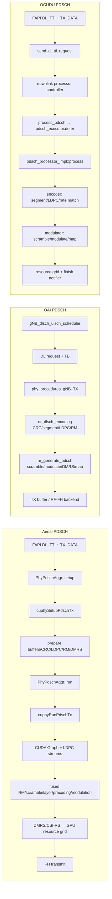
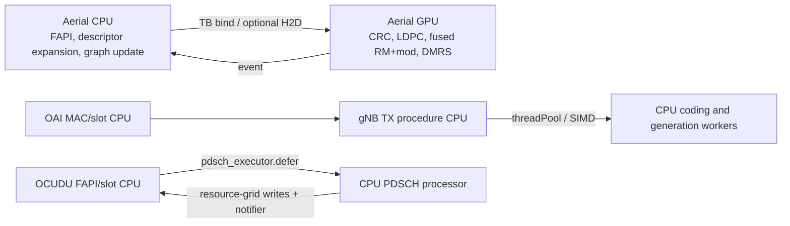

# NR gNB PDSCH 实现档案

**冻结基线：** Aerial `29f5870`；Duranta/OAI `31ffb21`；OCUDU `6d44c2a`  
**证据上限：** E2（固定提交源码）。文档中的 NVIDIA pipeline 描述用于定位，核心结论均回落到源码符号。

## 结论摘要

Aerial PDSCH 的核心差异是把 CRC、LDPC、rate matching、scrambling、layer mapping、precoding、modulation、DMRS/CSI-RS 与 resource-grid 输出作为 GPU pipeline 管理，并用 CUDA Graph 降低重复 launch 编排成本。其中 rate matching 至 modulation 的融合 kernel 是比“把某个算法移植到 GPU”更具体的差异化工作。

OAI 的冻结路径由 MAC scheduling request 进入 `nr_generate_pdsch`，使用 host buffers、定点复数和 SIMDe；OCUDU 经 FAPI translator、PDSCH executor、processor、encoder/modulator 写入 resource grid。两者都具备并行和向量化设计，但其冻结主路径没有采用 Aerial 式 CUDA Graph 作为整条 PDSCH 的调度骨架。

## 端到端调用图

## 分阶段源码追踪

| 阶段 | Aerial | OAI | OCUDU |
|---|---|---|---|
| 调度入口 | driver `PhyPdschAggr::setup/run` 调用 cuPHY create/setup/run API | scheduler 生成 request，`phy_procedures_gNB_TX` 消费 | FAPI `send_dl_tti_request` 获取 slot processor controller |
| TB 输入 | `pTbInput` 可为 CPU/GPU buffer；CPU 路径有 pinned/H2D 检查与 copy event | `new_gNB_dlsch` 分配 host `b/c/f`；TB 进入 encoding | `shared_transport_block` 随 PDU 移入异步 executor task |
| CRC/LDPC | 独立 prepare/run 阶段；异构 LDPC 配置可分配到多个 CUDA streams | CRC、segmentation、LDPC TB params；thread pool jobs | `pdsch_encoder_impl::encode` 逐 CB segment、LDPC、rate-match |
| RM 到调制 | `fused_dl_rm_and_modulation` 融合 RM、scramble、layer map、precoding、modulation | `nr_dlsch_encoding` 后由 `nr_generate_pdsch` 做 scramble/modulation/map | encoder 与 modulator 对象分离；bit buffers 与 `ci8_t` symbol buffer |
| 参考信号/栅格 | `fused_dmrs`；可选 CSI-RS；输出 GPU `__half2` tensor | DMRS 与 data 写入定点 TX/grid buffer | DMRS/PTRS helpers 与 modulator 写 `resource_grid_writer` |
| 完成/错误 | CUDA events；setup 失败时 driver 跳过 run；callback/cleanup | procedure timing/stats 与线程同步 | state task counting、finish notifier；enqueue 失败记录 warning |

## 缓冲区生命周期

## CPU/GPU/线程边界

## 差异矩阵

| 维度 | Aerial | OAI | OCUDU | 可下结论 |
|---|---|---|---|---|
| 调度骨架 | reusable CUDA Graph + LDPC streams/events | procedural C + slot threads/thread pool | executor-deferred processor pipeline | E2：编排方式不同 |
| kernel fusion | RM、scramble、layer map、precoding、modulation融合 | 各 C 函数/向量化阶段组合 | encoder/modulator/resource-grid mapper 分层 | E2：Aerial 存在明确跨阶段融合 |
| TB 所在域 | CPU 或 GPU；CPU 路径可 H2D | host buffers | host/shared transport block | E2：Aerial 暴露 GPU TB 输入模式 |
| 输出格式 | GPU `__half2` resource-grid tensor | fixed-point host TX/grid data | `resource_grid_writer` + `ci8_t` symbols | E2：输出所有权与表示不同 |
| 可复用拓扑 | worst-case graph，动态禁用不用的 LDPC nodes | 复用 buffers/threads，而非 CUDA graph | 复用 processor pools/executors | E1+E2：优化对象不同 |
| 性能结论 | 尚不可得 | 尚不可得 | 尚不可得 | 需统一硬件/配置 E4 |

## Aerial 的 CUDA 差异化工作拆解

1. **图级编排而非逐函数 offload。** PDSCH 为常见槽处理保留 graph executable；初始化最坏拓扑，在运行时更新参数并禁用不需要的 LDPC nodes。
2. **跨算法段 kernel fusion。** `fused_dl_rm_and_modulation` 把传统实现中多个内存往返阶段合并；这是最值得后续量化 L2/DRAM traffic 的代码点。
3. **LDPC 并行与主图解耦。** `ldpc_streams` 与 `ldpc_complete_events` 允许不同配置批次并发，再由 event 汇合到后续图节点。
4. **GPU resource grid 作为稳定交付物。** 输出 tensor 使用 `__half2`，按 symbol/PRB/layer 组织，并面向后续 FH 路径；差异化延伸到 PHY/FH 数据边界。
5. **显式支持 CPU/GPU TB 输入。** 不是所有业务都天然驻留 GPU，driver 因而实现 pinned-memory 判定、batched H2D 和 event wait；这提供了可测量的异构集成成本入口。
6. **参考信号也纳入 GPU pipeline。** DMRS 使用融合实现，可选 CSI-RS 有独立 mapping/post-processing，避免把“数据通道加速”与完整 DL grid 生成混为一谈。

## 固定提交证据

### Aerial

- [`cuphy_api.h`](https://github.com/NVIDIA/aerial-cuda-accelerated-ran/blob/29f5870fd84b0176df48b40667c1b8f1740e6d09/cuPHY/src/cuphy/cuphy_api.h)：PDSCH create/setup/run API、TB buffer type、`pTDataTx`。
- [`pdsch_tx.cpp`](https://github.com/NVIDIA/aerial-cuda-accelerated-ran/blob/29f5870fd84b0176df48b40667c1b8f1740e6d09/cuPHY/src/cuphy_channels/pdsch_tx.cpp)：buffer allocation、CPU/GPU input、pinned H2D、events/graphs。
- [`pdsch_tx.hpp`](https://github.com/NVIDIA/aerial-cuda-accelerated-ran/blob/29f5870fd84b0176df48b40667c1b8f1740e6d09/cuPHY/src/cuphy_channels/pdsch_tx.hpp)：prepare/run stages、`exec_graph`、LDPC streams/events。
- [`phypdsch_aggr.cpp`](https://github.com/NVIDIA/aerial-cuda-accelerated-ran/blob/29f5870fd84b0176df48b40667c1b8f1740e6d09/cuPHY-CP/cuphydriver/src/downlink/phypdsch_aggr.cpp)：TB binding、H2D event wait、setup/run/callback。
- [`dl_rate_matching.cu`](https://github.com/NVIDIA/aerial-cuda-accelerated-ran/blob/29f5870fd84b0176df48b40667c1b8f1740e6d09/cuPHY/src/cuphy/dl_rate_matching/dl_rate_matching.cu)、[`crc.cu`](https://github.com/NVIDIA/aerial-cuda-accelerated-ran/blob/29f5870fd84b0176df48b40667c1b8f1740e6d09/cuPHY/src/cuphy/crc/crc.cu)、[`ldpc_encode.cu`](https://github.com/NVIDIA/aerial-cuda-accelerated-ran/blob/29f5870fd84b0176df48b40667c1b8f1740e6d09/cuPHY/src/cuphy/error_correction/ldpc_encode.cu)、[`pdsch_dmrs.cu`](https://github.com/NVIDIA/aerial-cuda-accelerated-ran/blob/29f5870fd84b0176df48b40667c1b8f1740e6d09/cuPHY/src/cuphy/pdsch_dmrs/pdsch_dmrs.cu)：CUDA kernel 实现位置。

### OAI

- [`gNB_scheduler.c`](https://github.com/duranta-project/openairinterface5g/blob/31ffb21a8204ae9706a88eb08606a80fc8eafb3e/openair2/LAYER2/NR_MAC_gNB/gNB_scheduler.c)：`gNB_dlsch_ulsch_scheduler`。
- [`phy_procedures_nr_gNB.c`](https://github.com/duranta-project/openairinterface5g/blob/31ffb21a8204ae9706a88eb08606a80fc8eafb3e/openair1/SCHED_NR/phy_procedures_nr_gNB.c)：`phy_procedures_gNB_TX` 到 `nr_generate_pdsch`。
- [`nr_dlsch_coding.c`](https://github.com/duranta-project/openairinterface5g/blob/31ffb21a8204ae9706a88eb08606a80fc8eafb3e/openair1/PHY/NR_TRANSPORT/nr_dlsch_coding.c)：host buffers、CRC/segmentation/LDPC。
- [`nr_dlsch.c`](https://github.com/duranta-project/openairinterface5g/blob/31ffb21a8204ae9706a88eb08606a80fc8eafb3e/openair1/PHY/NR_TRANSPORT/nr_dlsch.c)：定点/SIMDe PDSCH generation。

### OCUDU

- [`fapi_to_phy_fastpath_translator.cpp`](https://gitlab.com/ocudu/ocudu/-/blob/6d44c2a5e5b2a81a4c67460b460ef99e789943cf/lib/fapi_adaptor/phy/p7/fapi_to_phy_fastpath_translator.cpp)：`send_dl_tti_request` 和 slot controller。
- [`downlink_processor_multi_executor_impl.cpp`](https://gitlab.com/ocudu/ocudu/-/blob/6d44c2a5e5b2a81a4c67460b460ef99e789943cf/lib/phy/upper/downlink_processor_multi_executor_impl.cpp)：`process_pdsch`、`pdsch_executor.defer`、finish state。
- [`pdsch_processor_impl.cpp`](https://gitlab.com/ocudu/ocudu/-/blob/6d44c2a5e5b2a81a4c67460b460ef99e789943cf/lib/phy/upper/channel_processors/pdsch/pdsch_processor_impl.cpp)：encode/modulate/DMRS/PTRS 与 completion notifier。
- [`pdsch_encoder_impl.cpp`](https://gitlab.com/ocudu/ocudu/-/blob/6d44c2a5e5b2a81a4c67460b460ef99e789943cf/lib/phy/upper/channel_processors/pdsch/pdsch_encoder_impl.cpp)：CB segmentation、LDPC、rate matching。
- [`pdsch_modulator_impl.cpp`](https://gitlab.com/ocudu/ocudu/-/blob/6d44c2a5e5b2a81a4c67460b460ef99e789943cf/lib/phy/upper/channel_processors/pdsch/pdsch_modulator_impl.cpp)：scramble、modulate、layer/port mapping。

## 未决验证项

- `fused_dl_rm_and_modulation` 各模板/配置分支的读写字节数、occupancy 与 launch 数。
- PDSCH graph update、node disable、LDPC stream join 的逐节点依赖图。
- GPU TB 与 CPU TB 两种输入模式的 H2D 开销差异。
- Aerial GPU grid 到 FH NIC 的 copy/ownership 路径；“GPU resident”需按部署模式逐段确认。
- 与 OAI/OCUDU 在等价编码、层数、MCS、PRB 和 deadline 下的 profile；当前不得计算性能倍数。
