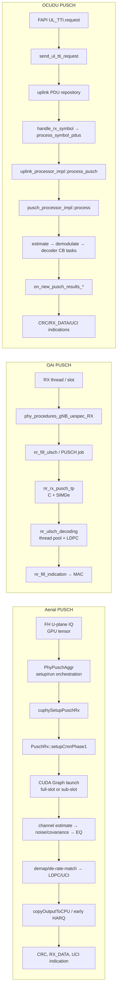
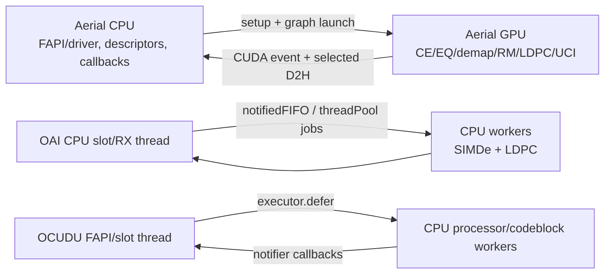

# NR gNB PUSCH 实现档案

**冻结基线：** Aerial `29f5870`；Duranta/OAI `31ffb21`；OCUDU `6d44c2a`  
**证据上限：** E2（固定提交源码）。本文不包含实机时延、吞吐或 deadline closure 结论。

## 结论摘要

Aerial 的差异不只是“用 CUDA 做 LDPC”。其 PUSCH 实现把前传接收张量、信道估计、噪声/干扰估计、均衡、解调、解速率匹配、LDPC 与 UCI 恢复组织成可复用的 CUDA Graph，并用 phase stream、event 和 full/sub-slot graph 显式表达时序。OAI 的冻结主路径以 C、定点 `c16_t`、SIMDe 向量化和线程池任务为核心；OCUDU 以 C++ processor、executor、`resource_grid_reader`、`unique_rx_buffer` 和 notifier 组织异步处理。

这证明三者的执行模型不同，但不能单凭静态代码推出 Aerial 更快，也不能证明 OAI/OCUDU 仓库中不存在任何可选硬件加速路径。

## 端到端调用图

## 分阶段源码追踪

| 阶段 | Aerial | OAI | OCUDU |
|---|---|---|---|
| 请求/入口 | `cuphySetupPuschRx`、`cuphyRunPuschRx`；driver 聚合器持有每槽输入输出 | `phy_procedures_gNB_uespec_RX` 与 `nr_fill_ulsch` 建立 PUSCH job | `send_ul_tti_request` 将 PUSCH PDU 放入 repository |
| 输入缓冲区 | `cuphyPuschDataIn_t::pTDataRx`，来自 order/decompression 后的 GPU IQ tensor | `c16_t` 接收样本、对齐的抽取/信道估计/LLR 工作区 | `resource_grid_reader` + `unique_rx_buffer`（HARQ rate-match soft buffer） |
| CE/EQ | CUDA channel-estimation、noise/interference、CFO/TA、EQ 组件 | `nr_rx_pusch_tp`，定点运算与 SIMDe 128/256 向量路径 | estimator 完成后由 notifier 触发后续 demodulation；typed spans/views |
| 解调/译码 | graph 内解调、de-rate matching、LDPC、UCI；LDPC 可使用独立 streams | symbol jobs + `nr_ulsch_decoding`；thread pool 并行 code blocks | `pusch_demodulator_impl::demodulate` 生成 LLR；`pusch_decoder_impl::fork_codeblock_task` 可向 executor defer |
| 完成/回传 | CUDA events 表达 sub-slot/full-slot 完成；显式 CPU 输出复制方法 | CRC 后 `nr_fill_indication` 回到 MAC | notifier 产生 `on_new_pusch_results_control/data`，再构造 FAPI CRC/RX_DATA/UCI |
| 错误/过载 | setup/run 返回错误；driver 有同步与清理路径 | job queue 满时可丢弃并记录；译码结果显式携带 CRC | executor/repository 获取失败时记录实时错误并产生 FAPI error indication |

## 缓冲区生命周期

```mermaid
flowchart TB
  subgraph A["Aerial"]
    A1["startup: allocate descriptor + component buffers"] --> A2["slot: pTDataRx points to GPU IQ"]
    A2 --> A3["graph nodes reuse device workspaces"]
    A3 --> A4["device output / mapped host pointer arrays"]
    A4 --> A5["event-gated copyOutputToCPU"]
    A5 --> A2
  end
  subgraph O["OAI"]
    O1["new_gNB_ulsch: allocate HARQ b/c/d"] --> O2["slot RX/extraction work buffers"]
    O2 --> O3["LLR + HARQ combine/LDPC"]
    O3 --> O4["TB/CRC indication"]
    O4 --> O2
  end
  subgraph S["OCUDU"]
    S1["slot resource grid"] --> S2["unique_rx_buffer acquired from pool"]
    S2 --> S3["softbits views + codeblock tasks"]
    S3 --> S4["decoded TB + notifier"]
    S4 --> S5["RAII returns unique buffer to pool"]
  end
```

## CPU/GPU/线程边界

## 差异矩阵

| 维度 | Aerial | OAI | OCUDU | 可下结论 |
|---|---|---|---|---|
| 主要并行抽象 | CUDA Graph、streams、events、kernels | slot/RX threads、FIFO、thread pool、SIMD | task executors、processor/notifier、CB tasks | E2：执行抽象不同 |
| 主要数值载体 | GPU tensor / CUDA buffers | 定点 `c16_t`、`int16_t` 与对齐数组 | `cbf16_t`/LLR spans、resource-grid views | E2：数据表达不同 |
| 跨域同步 | CUDA event 与显式 copy | CPU 队列、线程同步 | executor completion 与 callback | E2：同步原语不同 |
| HARQ soft buffer | GPU pipeline 内部缓冲与输出描述符 | gNB ULSCH HARQ 分配区 | pool-owned `unique_rx_buffer` | E2：所有权模型不同 |
| 静态源码能否证明性能 | 否 | 否 | 否 | 必须等硬件与统一负载 E4 |

## Aerial 的 CUDA 差异化工作拆解

1. **把整条接收链图化。** `PuschRx` 不只调用单个 CUDA kernel，而是持有 full-slot、front-loaded-DMRS、early-HARQ、pre-sub-slot 等多种 graph executable。
2. **用 stream/event 表达阶段时限。** API 和实现显式区分 phase 1/phase 2 stream，以及 sub-slot/full-slot 完成事件，服务早期 HARQ 与整槽处理两种交付点。
3. **把前传结果直接作为 GPU 输入。** `pTDataRx` 是 order/decompression 后的复数 IQ tensor；这缩短了 FH 到 upper-PHY 的软件边界，但是否“零拷贝”仍需逐配置验证。
4. **GPU 内覆盖接收链多个算法段。** 已定位 CE、噪声/干扰、EQ、de-rate matching、LDPC 和 UCI 组件，差异化范围明显大于单一 FEC offload。
5. **显式处理异构边界。** 映射 host 内存、CUDA events、`copyEarlyHarqOutputToCPU` 与 `copyOutputToCPU` 说明 CPU/GPU 边界仍存在，只是被有计划地放在少数交付点。

## 固定提交证据

### Aerial

- [`cuphy_api.h`](https://github.com/NVIDIA/aerial-cuda-accelerated-ran/blob/29f5870fd84b0176df48b40667c1b8f1740e6d09/cuPHY/src/cuphy/cuphy_api.h)：`cuphyCreate/Setup/RunPuschRx`、`cuphyPuschDataIn_t::pTDataRx`、phase streams/events。
- [`pusch_rx.cpp`](https://github.com/NVIDIA/aerial-cuda-accelerated-ran/blob/29f5870fd84b0176df48b40667c1b8f1740e6d09/cuPHY/src/cuphy_channels/pusch_rx.cpp)：组件创建、graph instantiation/update、phase setup。
- [`pusch_rx.hpp`](https://github.com/NVIDIA/aerial-cuda-accelerated-ran/blob/29f5870fd84b0176df48b40667c1b8f1740e6d09/cuPHY/src/cuphy_channels/pusch_rx.hpp)：输出复制、LDPC launch、graph/stream 成员。
- [`phypusch_aggr.cpp`](https://github.com/NVIDIA/aerial-cuda-accelerated-ran/blob/29f5870fd84b0176df48b40667c1b8f1740e6d09/cuPHY-CP/cuphydriver/src/uplink/phypusch_aggr.cpp)：driver 数据描述符、mapped host allocations、setup/run events。

### OAI

- [`phy_procedures_nr_gNB.c`](https://github.com/duranta-project/openairinterface5g/blob/31ffb21a8204ae9706a88eb08606a80fc8eafb3e/openair1/SCHED_NR/phy_procedures_nr_gNB.c)：UL procedure、译码与 MAC indication。
- [`nr_ulsch_demodulation.c`](https://github.com/duranta-project/openairinterface5g/blob/31ffb21a8204ae9706a88eb08606a80fc8eafb3e/openair1/PHY/NR_TRANSPORT/nr_ulsch_demodulation.c)：`nr_rx_pusch_tp`、定点/SIMDe 和工作缓冲区。
- [`nr_ulsch_decoding.c`](https://github.com/duranta-project/openairinterface5g/blob/31ffb21a8204ae9706a88eb08606a80fc8eafb3e/openair1/PHY/NR_TRANSPORT/nr_ulsch_decoding.c)：HARQ buffers、LDPC/thread pool。

### OCUDU

- [`fapi_to_phy_fastpath_translator.cpp`](https://gitlab.com/ocudu/ocudu/-/blob/6d44c2a5e5b2a81a4c67460b460ef99e789943cf/lib/fapi_adaptor/phy/p7/fapi_to_phy_fastpath_translator.cpp)：`send_ul_tti_request`、repository/resource-grid handoff。
- [`uplink_processor_impl.cpp`](https://gitlab.com/ocudu/ocudu/-/blob/6d44c2a5e5b2a81a4c67460b460ef99e789943cf/lib/phy/upper/uplink_processor_impl.cpp)：symbol-driven processing、executors、`process_pusch`。
- [`pusch_processor_impl.cpp`](https://gitlab.com/ocudu/ocudu/-/blob/6d44c2a5e5b2a81a4c67460b460ef99e789943cf/lib/phy/upper/channel_processors/pusch/pusch_processor_impl.cpp)：estimator/notifier/demodulator/decoder 串接。
- [`pusch_decoder_impl.cpp`](https://gitlab.com/ocudu/ocudu/-/blob/6d44c2a5e5b2a81a4c67460b460ef99e789943cf/lib/phy/upper/channel_processors/pusch/pusch_decoder_impl.cpp)：soft buffer、rate matching、LDPC codeblock executor。
- [`phy_to_fapi_results_event_fastpath_translator.cpp`](https://gitlab.com/ocudu/ocudu/-/blob/6d44c2a5e5b2a81a4c67460b460ef99e789943cf/lib/fapi_adaptor/phy/p7/phy_to_fapi_results_event_fastpath_translator.cpp)：PUSCH control/data 到 FAPI indications。

## 未决验证项

- Aerial 不同 PUSCH graph variant 的选择条件与每个 node 的依赖边。
- DPDK/DOCA/FH 输入到 `pTDataRx` 的逐配置 copy 清单。
- 三项目同一 numerology、带宽、层数、MCS、HARQ 配置下的阶段时间分解。
- Aerial early-HARQ 路径相对 full-slot 路径的 deadline 收益；必须留到有硬件环境时验证。
